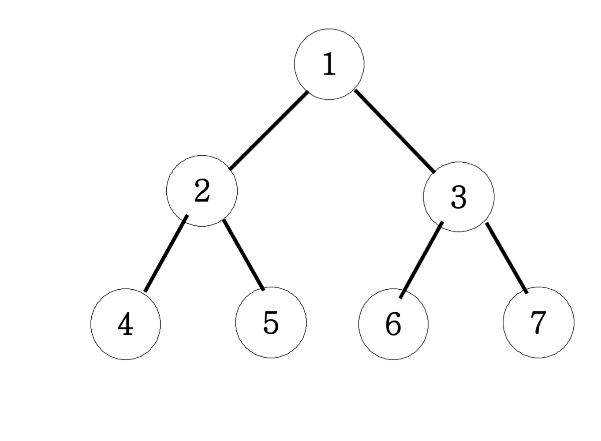
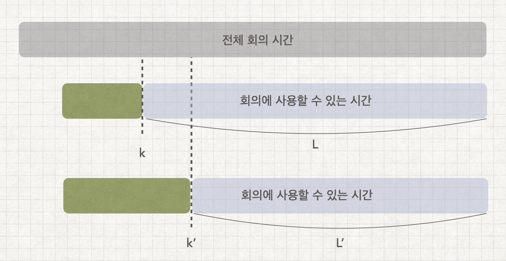
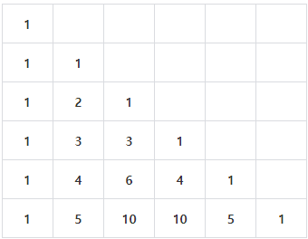

# JAVA_algorithm
자바 알고리즘 공부   
<https://inf.run/f12S>

01 String

### 1-1 문자 찾기
    String으로 받은 내용 중 char로 받은 단어를 포함한 갯수 찾기
    charAt()으로 String의 특정 index 접근 ex)charAt(0)로 0번째 문자를 char로 가져온다
    향상된 for문에서는 배열이 들어가야하는데 그때 String.toCharArray()로 간편하게 배열생성가능
    str = str.toUpperCase(); 로 String을 대문자화
    c = Character.toUpperCase(c); 로 char를 대문자화
### 1-2 대소문자 변환
    String으로 받은 내용 중 대문자일경우 소문자로 소문자일 경우 대문자로 변환
    빈 String에 +=로 char를 추가한다는 생각을 떠올려보자
    Character.isLowerCase(x)로 소문자를 isUpperCase로 대문자를 판별할수있다.
    다른 방법으론 아스키 코드를 이용하는방법인데
    대문자의 아스키 코드범위는 65~90
    소문자의 아스키 코드범위는 97~122
    대문자와 소문자의 차이가 32나는걸 이용하는 방법도 존재한다.
### 1-3 문장 속 단어
    한 문장 속 가장 긴 단어 출력, 각 단어는 공백으로 구분된다.
    가장 긴 단어가 여러개일 경우 가장 앞쪽에 위치한 단어를 답으로 한다.
    방법 1
    현재 가장 긴 단어의 길이를 갱신하는 방식
    String[] s = str.split(" "); 로 split한 string들을 for문으로 돌면서 해결
    방법 2
    while문과 indexOf, substring를 이용하여 index기반으로 자르고 비교하는 방식
    while((pos= str.indexOf(' '))!= -1)
    String tmp = str.substring(0,pos); 
### 1-4 단어 뒤집기
    n개의 단어를 입력받고 뒤집어서 출력
    StringBuilder의 reverse를 이용하면 쉽게 가능하지만
    while(lt <rt) 를 이용하여 하면 제약이 걸린 상황에서도 문제없음
### 1-5 특정 문자 뒤집기
    알파벳과 특수문자로 구성된 문자열에서 알파벳만 뒤집고 특수문자는 자리유지
    1-4 문제와 비슷하다
    다만 Character.isAlphabetic()를 사용하여 알파벳 유무를 판별하고 
    lt가 특수문자일때, rt가 특수문자일때, 둘다 알파벳일때 3경우로 나누는걸 생각한다면 구현은 쉽다.
### 1-6 중복문자 제거
    문자열에서 먼저나온 문자의 중복이 나올경우 제거하는 문제
    (str.indexOf(str.charAt(i))==i 를 이용하는게 가장 핵심
    현 index와 현 알파벳이 최초로 발견된 index가 같을때 answer에 추가하는 방식
### 1-7 회문 문자열
    거꾸로 읽어도 같은 문자열을 회문 문자열이라 명하고 대소문자를 구분하지않는다.
    첫번째로 맨 앞과 맨뒤를 length/2번 비교하는 방식으로 확인가능하고
    두번째로 StringBuilder의 reverse로 문자열을 뒤집은뒤
    str.equalsIgnoreCase로 대소문자 구분없이 두 문자열을 비교하여 판별하는 방식이 있다.
### 1-8 유효한 팰린드롬
    회문을 팰린드롬이라고 한다. 알파벳만 가지고 검사하며 대소문자 구분하지않습니다.
    Character.isAlphabetic()로 알파벳 유무 판별해서 알파벳 뽑아낸뒤 1-7방식을 쓰려했는데
    강의에선 replaceAll 매소드에 정규표현식을 사용해서 알파벳을 제외한 문자들을 제거했다.
    str = str.toUpperCase().replaceAll("[^A-Z]","");
### 1-9 숫자만 추출
    문자열 속에서 숫자만 추출하여 순서대로 자연수 생성
    x>=48 && x<= 57 일때 a = a*10 +(x-48) 로 아스키 번호 활용한 방법1
    Character.isDigit(x)으로 숫자판별해서 누적하는 방법2
    Integer.parseInt로 string을 int로 변환해주자
    나는 str = str.replaceAll("[^0-9]",""); replaceAll의 정규식을 활용했음
### 1-10 가장 짧은 문자거리
    문자열과 문자가 주어졌을때 해당 문자열에서 문자와 주어진 문자사이의 최소거리 출력
    ex)student t  = 1012210
    생각하기 어려운 문제 같다...
    처음 거리를 주어진 길이인 100보다 크게 둔다 ex)1000
    정답 문자열인 answer를 만들고 입력 문자열을 왼쪽부터 끝까지 돌면서
    같은 문자일경우 0을 answer에 집어넣는다.
    계속돌면서 같은 문자가 아닐경우 +1를 해서 집어 넣는다.
    이렇게 한바퀴를 돈뒤에 오른쪽부터 왼쪽으로 문자열을 도는데
    거리를 다시 1000으로 시작하고 전과 같은 방식으로 하되
    answer 문자열에 집어 넣을때 answer의 숫자값과 현재 계산한 값을 서로 비교한다.
    비교해서 더 작은 값으로 answer를 교체 한다.
    Math.min으로 작은값 리턴 가능하다.
### 1-11 문자열 압축
    문자열을 입력받고 연속으로 나오면 뒤에 숫자로 표기해준다. 단 한번일땐 생략
    ex) KKHSSSSSSSE -> K2HS7E
    answer=""로 시작해서 +로 채워나가는 방법으로 시작할건데
    이 알고리즘의 핵심은 int cnt=1를 정의해두고 현 문자와 다음문자가 같을때 cnt를 ++한뒤
    만약 다르면 현문자를 answer에 집어넣고(+=) cnt가1보다 크면 cnt도 집어넣는다(+=)
    여기서 주의해야할 점은 다음문자를 비교해야되는데 마지막 문자같은 경우는 다음문자가없어서
    에러가 나기때문에 미리 문자열을 받을때 빈공간을 하나 더 넣어주자
### 1-12 암호
    문자열이 #과 *로 이루어져서 입력 되는데 7의 배수만큼 입력된다
    #은 이진수의 1이고 *은 0이며 바꿔진 이진수를 7자리씩 십진수화한걸
    아스키코드로 변환하면 대문자 알파벳으로 변환되는 암호입니다.
    또 여기서도 answer=""로 시작해서 +로 채워나가는 방법으로 시작할건데
    substring을 이용해서 7개씩 자르는거 기억하자(substring(0,7))
    그리고 replace로 #은 1로 *은 0으로 바꾸고
    Integer.parseInt(tmp,2)를 사용해서 이진수를 십진수로 바꿀수있다
    바꿔진 십진수를 char로 casting해줘서 대문자 알파벳으로 표시한다.
    substring(7)로 계속 잘라주는것도 잊지말자

02 Array

### 2-1 큰 수 출력하기
    n개의 정수를 입력받아 바로 앞수 보다 큰수만 출력, 단 첫번째는 무조건출력
    ArrayList<Integer>에 정수들을 add해서 담는데 앞 인덱스와 비교해서 클때만 담자
### 2-2 보이는 학생
    n명의 학생이 일렬로 앉아있을때 선생님이 볼수있는 학생의 수 구하기
    단 학생들은 앞 학생들보다 클때 보이고, 작거나 같으면 보이지않는다.
    이중 for문으로 앞으로 다시가서 검사하려했더니 시간초과가 뜸...
    결국 max 변수를 만들어서 계속 초기화 해주는 방식으로 구현
### 2-3 가위 바위 보
    A와 B 둘이서 가위바위보를 하는데 1:가위, 2:바위, 3:보
    이긴 사람을 출력하고 비기면 D를 출력
    A과 이겼을때 비겼을때 그외(졌을때 = B가 이긴것)
    세가지 상황으로 분류하여 구현했다.
    강사는 return값이 string이어서 향상된 for을 쓸때 toCharArray()과정이 필요했다.
### 2-4 피보나치 수열
    입력받은 정수만큼 피보나치 수열을 출력한다.
    재귀방식도 생각해봤지만 빅오가 너무 커질거같아서 반복으로 풀이를 생각함
    입력받은 정수크기의 배열을 선언하고 1 1 을 미리 넣어둔뒤
    for문을 돌면서 뒤뒤에꺼 와 뒤에 꺼를 더해서 배열에 넣는 방식으로 풀이했다.
    다만 배열을 사용하지 않고 하려면 a=1 b=1 c 3개의 정수를 미리 선언하고
    c= a+b 를 한뒤 그다음엔 a가 b가되고 b가 c가 되기때문에 a=b, b=c를 해줘야한다.
### 2-5 소수(에라토스테네스 체)
    입력된 자연수까지의 소수의 개수 출력
    그냥 소수 구할때는 자기 자신하고 1 빼고 나눠지면 아니다로 판정하려했으나
    시간복잡도때문에 에라토스테네스의 체 사용
    2부터시작해서 입력받은 n까지 돌면서
    0일때 체크하고 그 배수들을 다 1로 초기화해서 pass
### 2-6 뒤집은 소수
    n개의 자연수를 입력받고, 각 자연수를 뒤집은뒤 소수면 출력
    강사는 숫자를 10으로 나누어서 일의 자리수부터 하나씩 뽑아내고
    뽑아낸 숫자를res=0, res = res * 10 + t 이런식으로 해서 숫자를 뒤집었다
    나는 string으로 받아서 이전에 lt와 rt로 뒤집고 int로 변환함
    소수판별 매서드를 하나따로 만들고 1과 자신을 제외한 숫자로 나뉘면 소수가 아니라고판별함
### 2-7 점수계산
    맞은 문제를 1점 틀린문제를 0점으로 하는데 연속으로 맞출시
    가산점을 부여하여 +1을 추가한다.
    tmp 변수를 사용하여 1일때 +1추가하고 0일때는 0으로 초기화 해주는게 포인트
### 2-8 등수구하기
    n명의 학생을 등수 매긴다. 단, 같은 점수는 같은등수로 동일처리
    cnt를 1로 두고 들어온 인덱스의 값을 전체와 비교해서
    다른 인덱스 값보다 작으면++를 해준다.
### 2-9 격자판 최대합
    입력된 n의 n*n크기의 격자판의 각행, 각열, 두 대각선의 합 중 가장큰값 출력
    나는 이차원 배열로 받은뒤 일일이 다 구해보고 가장큰값 찾았음
    강사도 비슷한 방식이지만 코드가 간결함, 다구하고 Math.max로 미리 정리해놓은등
### 2-10 봉우리
    격자판에서 가장자리는 0으로 초기화하고 자신의 상하좌우 숫자보다 큰곳은 봉우리다.
    같으면 봉우리 X
    이차원배열의 사방탐색을 사용했다. 미리 direction이라는 이차원배열에 사방이동을 저장해두고
    불러와서 쓰는 형식으로 구현했다.
    근데 항상 느끼지만 x y 이동이 [y][x] 이동이여서 맨날 헷갈린다.
    나는 indexOutOfRange가 나올까봐 미리 0으로 초기화된 배열을 만들었는데
    강사는 nx>=0 && nx<n 이런식으로 범위를 지정해둬서 회피했다.
### 2-11 임시반장 정하기
    1~5학년동안 n명의 학생들 중 같은반이었던 학생이 많은 학생이 반장이된다
    단 같은 경우엔 번호가 작은 학생이 반장이된다.
    세로로 학년별로 비교를 하려했으나 실패했다. 
    전혀 해결방안은 떠올리지 못한 문제... 다중for문에 취약함 gg
    가로로 즉 학생별로 비교를 하는 걸 생각해야한다.
    또한 같은 경우를 생각해서 최대치인 학생을 앞에서 부터 찾는데
    찾자마자 바로 break해준다. 그래야 맨번호가 나옴
    
### 2-12 멘토링
    n명의 학생과 m번의 시험을 보면서 멘토 멘티가 가능한 쌍을 구한다.
    멘토는 m번의 시험 전부에서 멘티보다 높은 등수여야한다.
    정말 많이 헤맨 문제.... 다중 for문으로 넘어갈수록 머리가 안돌아간다.gg
    n명의 학생이 있기 때문에 경우의 수는 n*n 쌍이 생긴다. n*n쌍을 만들고
    멘토가 될 학생과 멘티가 될 학생의 테스트 등수를 비교해서 
    멘토가 등수가 더 크면 false를 반환하여 멘토자격X
    되면 true를 반환한뒤 n*n쌍를 1로만든다.

03 Two pointers, Sliding window

### 3-1 두 배열 합치기
    오름차순으로 정렬된 두 배열을 오름차순으로 다시 하나의 배열로 합치기
    두개의 cnt 값을 설정하고 while문을 통해 루프하면서 add 해준다.
    for문 만 생각했었는데 while문 쓰는거 까먹지말자
### 3-2 공통원소 구하기
    두 집합에서 공통원소를 추출하여 오름차순으로 출력해라
    처음엔 이중 for문 으로 해봤는데 당연히 시간초과 나왔고
    cnt를 두개 설정해서 while문을 통해 도는 방식으로 했다.
    다만 두 집합을 Arrays.sort()로 미리 오름차순으로 정렬했다.
    1. 미리정렬 2. 2개의 포인터로 while문 순회 3.조건만족시 add
    이런식으로 생각해야되는것같다.
### 3-3 최대 매출
    n일중 연속된k일간의 최대 매출액 구하기
    이중 for문으로 생각했는데 시간초과 떠버림
    sliding window라는 기법 사용, 길이가k인 창문을 생각해서 계속 미는형식
    최초엔 k크기만큼의 창문 구하고 그담부턴 다음인덱스를 더하고 맨뒤 인덱스를 빼는형식으로 창문유지
    max+= (arr[i]-arr[i-k]); 이런식으로
    max가 answer변수보다 클때 초기화해주는 형식으로 구하자
### 3-4 연속 부분수열
    n개의 수로 이루어진 수열에서 연속된 부분수열의 합이m이 되는경우 구하기
    나는 2개의 포인터를 이용하여 원하는수보다 커지면 인덱스를+1 해서 진행했는데
    강사는 2개 포인터와 sliding window 를 섞어서 씀. 굳이?
### 3-5 연속된 자연수의 합
    양의 정수 n을 연속된 자연수의 합으로 가능한 가짓수 출력
    나는 n을 n개의 int[]로 만들어서(ex n=5  arr= 1 2 3 4 5)
    포인터를 2개써서 확인하는 방식으로 했다. (3-4 참고)
    강사는  ex) n=15 일때  2개로 나뉘어 지려면 1+2=3을 빼고 15-3=12
    12/2 =6  1+6 , 2+6 이렇게 나누어지면 가능하다 방식을 사용했다.
### 3-6 최대 길이 연속부분수열
    0과 1로 구성된 수열에서 최대 k번 만큼 0을 1로 변경가능할때 최대 1부분길이
    어떻게 풀어야할지 감을 못잡음 gg
    포인터 2개와 sliding window로 푸는데 rt가 움직이는데 1일때는 지나가고
    0일때는 cnt를 올린다. cnt가 k보다 커질때는 lt를 움직여서 0을 1로 바꾼걸
    다시 0으로 돌리면서 cnt를 줄여준다.rt-lt+1로 길이를 구하고 
    answer보다 커질때 answer를 초기화해준다.

04 HashMap, TreeSet

### 4-1 학급 회장
    후보중 가장 많이 선택된 후보를 출력
    배열로 받아서 그냥 갯수 세려했는데 해쉬를 써봐야될것같아서
    HashMap을 사용해서 풀어봄. containsKey로 있는거면 그냥 value값을 +1해주고
    없는거면 새로운 후보니까 put해줌, 최대값은 key를 순회하며 초기화하는 방식으로함
    강사는 map.put(x,getOrDefault(x,0)+1)을 사용해서 좀더 간편하게 map세팅을함
    size로 key갯수를 알수있다. remove로 제거가능. keySet으로 순회하는거 중요
### 4-2 아나그램
    anagram은 알파벳의 나열순서는 다르지만 그 구성이 일치할 경우를 의미한다.
    ex) apple  ppela
    입력받은 두 문자열이 아나그램인지 YES NO로 판별한다.(대소문자 구분)
    난 HashMap을 사용하여 풀었다. getOrDefault로 처음 문자열을 받고
    그 다음 문자열을 받을때 getOrDefault로 같은게 있으면 value값을 -1하는 방식
    그리고 value를 돌면서 0이 아닌값이 있으면 아나그램이 아니라고 생각한다.
### 4-3 매출액의 종류
    n일간의 매출기록중 연속된 k구간 매출액의 종류를 모두반환한다.
    처음엔 HashSet을 이용해서 중복제거를 하려고했는데... 이걸 이용하자니
    이중for문을 써야해서 시간 초과~
    원하는대로 HashMap의 size() 즉 key갯수와 sliding window를 결합해서 풀었다.
    여기서 생각해야되는점이 value값이 0이되면 해당 key를 remove해줘야 size()할때 포함이안된다는점
    형태 자체는 문제3-3의 변형느낌으로 품
    강사도 유사하게 푼듯? 다만 굳이 lt rt를 할이유가 있나 싶음
### 4-4 모든 아나그램 찾기
    S문자열에서 T문자열과 아나그램이 되는 S의 부분문자열의 개수를 구하라
    s 와 t 로 map 2개 만들어서 비교하는 방식
    lt와 rt로 sliding window를 돌면서 확인
    isEqual메소드를 만들어서 두map이 같은지 확인했다.
    나는 isEqual를 따로 만들었는데 map.equals()로 간편하게 확인가능함...
### 4-5 k번쨰 큰 수
    1~100 사이 숫자 n장을 가지고있는데 미리 뽑아둠
    이 n장에서 3번 뽑아서(중복허용X) 더한 값 중 k번째로 큰값찾기, 없으면 -1 return
    삼중 for문으로 하면 시간초과 나려나? 했는데 n이 최대100이라 n^3의 상황에서도 1000ms안쪽
    삼중 for문으로 경우 다 구하고 HashSet에 집어넣어서 중복은 다 제거함
    ArrayList에 넣고 sort하는데 Collections.sort(answer,Collections.reverseOrder());
    내림차순으로 정렬함
    answer.size()가 k-1보다 클때 answer.get(k-1)로 값 리턴해주고 작으면 -1리턴
    강사는 TreeSet을 이용해서 set의 중복제거와 자동으로 정렬되게 했다.
    TreeSet<Integer> Tset = new TreeSet<>(Collections.reverseOrder));
    TreeSet에는 first 와 last 메소드가 있는데 각각 맨앞 맨뒤 값을 가져온다.

05 Stack,Queue

### 5-1 올바른 괄호
    괄호가 올바르게 입력되면YES 아니면 NO
    Stack을 이용해서 (가 입력되면 스택에 집어넣고 아니면 즉 )면pop하는데
    Stack 내부에 아무것도 없을때 pop하려하면 바로 false를 리턴한다.
    stack.pop()
    stack.add()
    stack.push()
    stack.empty()
### 5-2 괄호문자제거
    입력된 문자열중 소괄호 사이에 있는 모든 문자 제거 후 남은 문자 출력
    제대로 입력했다는 가정이 전제인듯?
    stack에 push하는데 만약 ')'면 peek로 스택맨위 검사하면서 (일때까지 다 pop해버리는 방식으로 품
    강사도 같은 방식인데 나는 peek로 확인하고 pop했는데 강사는 그냥 바로 pop해버림
    if(x==')') while(stack.pop()!='(') 이렇게 넘어감. 간편한듯?
    나는 향상된 for문으로 char가져왔는데 stack.get으로 하나씩 가져올수도있다.
### 5-3 크레인 인형뽑기(카카오)
    크레인으로 하나씩 뽑고 바구니에서 맨위에 있는것과 같으면 인형이 터지는 방식,터진인형갯수 return
    풀이에 앞서서 머리속 생각을 바로 옮기지않고 메모장에 정리한뒤 작성함.
    이렇게 하니까 어렵지 않게 풀이가능했음.
    이차원배열 arr[n][k]라 했을때 n을 돌면서 0이면 continue로 넘어가고 아니면 그값을
    pick으로 가져온뒤 가져온 pick값이 현재 스택의 peek와 같으면 pop한뒤 answer+2하고 pick다시0
    0보다 클때(즉 같지않을때) push해서 스택에 넣어주고pick0. 이때 스택에 암것도 없을때peek시 
    exception이 발생하기 때문에 empty()할때는 그냥 바로 push해주고pick0.
    알아둘점은 k에 move의 칸-1이 들어간다는 점
    강사도 비슷한 방식인듯 다만 push하고 pop하는 조건문세울때 좀더 깔끔한듯하다<- &&같은 조건을 나는 자꾸 잊는듯...
### 5-4 후위식 연산(postfix)
    후위연산자를 연산한 결과 출력,후위식연산? ex)3*(5+2)-9 -> 352+*9- 이런식으로 변경
    스택을 이용해서 숫자면 push 연산자가 나오면 pop() 두번해서 해당연산자에 맞는 연산하게 한뒤
    그 결과값을 다시 push하는 형식으로 구현했다.
    여기서 char로 숫자를 받아오는데 이걸 int로 바꾸는 방법은 다양하니 알아두자
    //stack.push(Integer.parseInt(String.valueOf(x)));
    //stack.push(Character.getNumericValue(x));
    //stack.push(x-48);
### 5-5 쇠막대기
    괄호로 이루어진 문자열에서 () 경우만 레이저이고 나머지는 (로시작해서 )로 끝나는 막대기
    레이저로 잘린 총 막대기의 조각수를 구해라
    처음에 보고 이게뭐지 싶었던 문제 고심끝에 생각한 방법은
    일단 ()인 경우를 L로 만든다음 순회하면서 L일때는 스택에 쌓인 size만큼 더해주고
    )일때는 막대기의 끝이니까 1를 더해준뒤 pop해준다.
    근데 ()를 L로 만드는걸 순회하면서 하려했더니 index에러가 났다.
    그래서 그냥 String의 replace 메소드를 사용해서 바꾸니 편하고 좋았다.
    String replaceStr = str.replace("()","L");
    강사와 생각하는건 비슷했는데 강사는 str를 i로 순회하면서 i-1값을 통해 막대기인지 레이저인지
    판단하는 방식을 사용했다.
### 5-6 공주 구하기
    n명의 사람중 k번째 때마다 사람을 뺀다. 마지막으로 남은 사람 return
    queue를 이용해서 구현했다. 큐의 size가 1이 되기전까지 돌면서
    cnt 값이k일때마다 remove하고 아니면 poll로 제거한뒤 다시 queue로 넣는다.
    Queue<Integer> queue =new LinkedList<>(); 자바에서 큐는 linkedlist로 생성해야한다.
    queue.offer() add와같은기능
    queue.add()
    queue.poll() 맨앞에걸뽑고(제거하고) 반환함
    queue.remove() 제거
    queue.size()
### 5-7 교육과정 설계
    처음에 꼭들어야하는 수업 순서가 있다(선수과목같은)
    다음으로 입력받는 자신이 짠 수업순서가 올바르면 YES 아니면 NO 반환
    큐를 만들고 짠수업에서 같은 값이 나오면 큐에서 제거하고 만약 큐가 비었다면 제대로 만든거로 판단
    강사는 contains로 일단 값이 존재하나 찾고 그담에 poll로 뽑은걸 비교해서 같지않으면 바로no리턴하는 방식
    이렇게하면 중간에 순서가 잘못된순간 바로 알수있어서 좋다. 내방식은 다 돌아봐야 알수있어서 별로인듯
### 5-8 응급실
    대기 중인 사람들중 현재 순서보다 위험도가 높은 사람이 있다면 현재순서인사람을 제일뒤로 놓고 다음 사람을 뽑는다.
    즉 대기목록에 자기 보다 위험도가 높은 환자가 없을 때 자신이 진료를 받는 구조.
    m번째 환자는 몇번째로 진료를 받는가?
    일단은 gg를 친문제
    구조는 이해했으나 중복 처리 방법을 몰랐다. 같은 위험도일때 어떻게 내가 처음 고른m번째 사람인지 구별방법을 생각못함
    결국 강사의 방식을 보니 class를 따로 만들어서 id 와 위험도를 만들어주고 id를 통해구분하는 방식을 사용했다.

06 Sorting, Searching String

### 6-1 선택 정렬
    선택정렬을 사용해서 오름차순으로 정렬, 출력하라
    선택정렬이란 처음부터끝까지 돌면서 가장 작은 값을 하나뽑고 그다음작은값을뽑고...
    이런식으로 쭉 훑어서 정렬하는것. O(n^2)의 시간복잡도를 가지고있으며 버블정렬보단 2배빠르다.
### 6-2 버블 정렬
    버블정렬을 사용해서 오름차순으로 정렬, 출력하라
    버블정렬은 1번째와2번째를비교 정렬, 2번째와 3번째를 비교정렬....n-1번째와 n번째 비교정렬 후
    다시 처음으로 돌아가 n-2번쨰와 n-1번째 까지 정렬.... 이런식으로 한번 돌때마다 마지막하나가 정렬된다.
    최악의 성능이기때문에 지양할것.
### 6-3 삽입 정렬
    삽입정렬을 사용해서 오름차순으로 정렬, 출력하라
    삽입정렬은 배열의 모든 요소를 차례대로 확인하는데 이미 정렬된 부분과 비교해서 자신의 위치를 찾아서 삽입한다.
    떠올리기 굉장히 어려운 정렬이었다. 한번 gg쳤었음
    i값을 1부터 시작하고 j=i-1로 두어서 확인할 값인 arr[i]와 그전값들인 arr[j]들을 비교해서 크면 앞으로 미는 정렬이다.
    arr[i]가 더크면 멈추고 멈출때 기억한 j값에 1를 더해서 해당 위치에 삽입하면 정렬된다.
    https://hahahoho5915.tistory.com/8 <-이해안되면 보는 블로그
### 6-4 Least Recently Used
    LRU 알고리즘을 토대로 만드는 알고리즘
    contains 메소드를 따로 만들어서 캐시에서 동일한 작업번호가 있으면 해당 인덱스를 가져오고 아니면-99를 반환
    -99가 반환되면 삽입정렬때를 응용해서 캐시끝부터 처음까지 돌며 앞으로 한칸씩 당기고 첫칸에 해당 작업삽입
    -99가 아니면 인덱스가 반환된것이므로 해당 인덱스 부터 한칸씩 당기고 첫칸에 인덱스의 값 삽입
    강사와 같은 방식, 다만 난 인덱스를 가져오는 과정을 메소드로 따로 뺌
### 6-5 중복 확인
    자연수 중복여부 확인
    나는 입력받은 배열을 set에 집어넣어서 set.size()와 원래 배열 length를 비교해서 
    다르면 중복이있음, 같으면 유니크함 으로 판별했다.
    강사는 sort 한뒤 for문돌면서 이번 인덱스값과 다음 인덱스 값이 같은 경우 중복있음으로 판별함
### 6-6 장난꾸러기
    정렬된 정수들 사이에서 누가 두개의 위치를 서로 바꿨다. 바꾼 두 위치값을 반환하자.
    나는 정렬한 값과 원래의 값끼리 비교해서 위치를 찾았다. lt rt를 설정해서 앞에서 한번 찾고 뒤에서 한번찾았는데
    그럴필요가 없었네. 강사는 그냥 다를때마다 add넣어서 그냥 한번에 해결.
### 6-7 좌표 정렬
    n개의 평면좌표(x,y)들을 정렬하는데 x기준으로 오름차순으로 정렬하고 x값이 같을땐 y값 기준으로 오름차순으로정렬
    이차원배열로 푸는데 Array.sort()를 단순히 사용하려니 안되길래 gg쳤었다. 살펴보니 이차원배열은 comparator를 implements해서
    해야 되더라. 그래서 람다식을 이용해서 사용했고 o1[0] 과 o2[0]으로 비교해서 같을때는 o1[1] o2[1]로 두번째 인자를 비교했다.
    여기서 return 되는 값이 음수면 오름차순이고 양수면 내림차순인듯함. Integer.compare(o1[1],o2[1])로 비교간단히
    강사는 클래스를 따로 만들고 Comparable를 implements해서 compareTo를 오버라이딩 해서 Collection.sort로 해결함
    알아는 두는게 좋을듯함!
### 6-8 이분검색
    배열을 오름차순으로 정렬한뒤 이분검색(이진탐색)을 통해 m의 위치를 찾는다.
    이분검색은 배열의 절반에서 큰지 작은지를 확인한뒤 다시 절반으로 나누고 큰지 작은지 판단을 계속해서 하는 검색이다.
    매 단계에서 검색할 리스트의 크기를 절반으로 줄인다.
    나는 lt 와 rt를 설정한뒤 middle값을 계속구하고 arr[middle]보다 클때는 오른쪽이니까 lt= middle+1
    반대의 경우엔 rt = middle -1를 해서 lt<=rt인 동안 계속해서 반복하게 했다.
    강사도 같은 방식으로 풀었넹
### 6-9 뮤직비디오
    결정알고리즘 문제.
    n개의 곡을 m개의 dvd로 나눠서 담는데 dvd의 최소 용량 크기를 구하라.(각 dvd 크기는 동일)
    나는 최소용량이 곡중 가장 큰값 즉 1개만 들어갈때 라고 정하고, 모든곡이 한dvd에 들어갈 때 해서
    least 와 max를 구해둔뒤 least가 max보다 작거나 같을때 least를 +1하면서 찾는 방식을했다.
    for문으로 곡들을 돌면서 만약 더해진 값들이 least보다 크면 만들어둔 ArrayList에 추가하고 아니면 sum해두는방식으로 확인
    마지막으로 ArrayList의 크기가 원한 m개의 갯수보다 작거나 같을때 최소값이라고 판단했다.
    강사는 이분검색을 통해서 결정알고리즘을 푸는것이라고 했다. 내방식은 너무 문제에fit한듯;
    mid값을 용량의 크기로 잡고 가능할때 일단 저장해두고 왼쪽값을 살펴보고 불가능하면 오른쪽 값을 살펴보는방식
    더 컴팩트하고 좋은것같다. 다만 아직은 이정도로 생각하지는 못하겠...
    //Arrays.stream(arr).max().getAsInt(); 배열값중 가장큰값 가져오기
    //Arrays.stream(arr).sum() 배열값 다 더하기
### 6-10 마구간 정하기
    gg친 문제. 구현 방향을 잡기 어려웠다. 다시 한번 볼것
    결정알고리즘을 통해 푼 문제. 결정 알고리즘은 결국 답을 계속 좁혀나가서 최고의 답을 찾아 나가는 알고리즘인데
    여기서는 가장 가까운 두 말의 최대거리를 구하는게 목적이기 때문에 즉, 말 사이의 거리 중 최고의 답을 찾아가는것이다.
    거리는 1부터 최대arr[n-1] 까지의 범위 내에 존재하고 이분 탐색을 응용해서 값을 더 빠르게 찾아나가보았다.
    결국 핵심은 배치할수있는 말의수가 c마리의 말보다 같거나 클때 조건이 성립하므로 이분탐색으로 계속해서 찾아나가는게 핵심

07 Recursive, Tree, Graph

### 7-1 재귀함수
    재귀 함수는 스택 프레임을 사용한다. 따라서 부르는 위치에 따라서 반환되는값이 다르다!
    ex)     System.out.println(n);
            DFS(n-1);                   // 반환값 n n-1 n-2 ...
    ex)     DFS(n-1);
            System.out.println(n);    // 반환값 1 2 ... n-1 n 

    위 두 상황의 반환이 완전 반대다.
    스택프레임 안에는 매개변수 정보와 지역변수정보, 그리고 함수가 끝났을 때 복귀주소가 들어있다.(백트래킹?)
    void일때 return;으로 끝내기 가능
### 7-2 이진수 출력
    재귀를 이용해서 이진수를 출력해보자.
    스택 프레임을 이용해서 DFS(n/2)를 부르며 n%2값을 출력한다. 종료조건은 n==0일때로 지정
### 7-3 팩토리얼
    재귀를 이용한 팩토리얼 구현
    스택 프레임을 이용해서 n*DFS(n-1)을 부르고 종료조건은 n=1 일때 1 return
### 7-4 피보나치
    재귀 함수를 이용한 피보나치 수열 출력
    반복문이 더 좋긴하지만 재귀함수를 통해 구현해보자.
    그냥 재귀함수를 사용하면 이미 구했던 값을 다시 구하는 과정에서 시간 소모가 심하다.
    따라서 메모이제이션을 사용해서 시간을 단축해보자.
    메모이제이션은 동일한 계산을 반복해야 할 때, 이전에 계산한 값을 메모리에 저장함으로써
    동일한 계산의 반복 수행을 제거하여 프로그램 실행 속도를 빠르게 하는 기술이다.
    피보나치를 구하면서 구해진 값을 arr에 저장해서 그 값이 필요할때 꺼내서 쓰면 계산과정이 단축되는걸 이용한다.
### 7-5 이진트리순회

    이진 트리를 순회하는 방법에는 3가지 방법이 있다.
    전위 순회 : 부모 -> 왼쪽 자식노드 -> 오른쪽 자식노드  // 1 2 4 5 3 6 7
    중위 순회 : 왼쪽 자식노드 -> 부모 -> 오른쪽 자식노드 // 4 2 5 1 6 3 7
    후위 순회 : 왼쪽 자식노드 -> 오른쪽 자식노드 -> 부모 // 4 5 2 6 7 3 1
    부모의 위치가 순회이름을 결정하는듯?
    재귀의 방식을 사용하는데 탈출조건은 null일때 return; 한다. 
    그외에는 왼쪽자식 노드와 오른쪽 자식 노드를 탐색한다. 이때 어디에 print를 넣느냐에 따라 순회가 바뀐다.
    if (root == null)
        return;
    else {
        //System.out.print(root.data + " ");  전위 순회
        DFS(root.lt);
        System.out.print(root.data + " "); //중위 순회
        DFS(root.rt);
        //System.out.print(root.data + " "); 후위 순회
        }
### 7-6 부분집합 구하기
    재귀를 활용한 모든 부분 집합 구하기.
    int 배열 int[] ch 를 만들어서 현재 입력된 L 값이 포함된지 안된지를 판별한다. 1일경우 O, 0일경우 X
    스택 프레임을 이용하는데 1부터 n까지의 숫자를 돌면서 숫자가 포함된경우 포함되지않은경우 2가지로 나누어서 진행되는게 포인트
    이해는 할수있지만 아직까지 이런 알고리즘을 떠올리는것은 어려운것같다...
### 7-7 이진트리 레벨탐색
    7-5번의 이진트리를 DFS방식이 아닌 BFS방식으로 풀어보자.
    BFS는 루트로 부터 거리(레벨)을 기준으로 가까운 것부터 방문하는 방식이다.
    일반적으로 큐를 사용해서 반복적 형태로 구현하는 것이 잘 작동한다. DFS때는 재귀방식을 사용했었다.
    노드의 왼쪽 오른쪽이 null이 아니면 큐에 집어넣고 레벨을 +1하는 방식이다. 자세한건 코드 참조
### 7-8 송아지 찾기 1
    현재 위치로 부터 수직거리에 있는 송아지를 +1 , -1 , +5 의 이동 거리로만 움직이는 최소 횟수 구하기.
    최소 횟수를 구하려면 BFS를 사용해야한다고 생각해서 BFS를 사용했다.
    큐를 이용했고 레벨을 통해 횟수를 측정했다. +1인 경우 -1인경우 +5인 경우와 송아지 위치와 비교해서
    찾았는데 처음에는 시간 초과가 발생했다.
    이걸 어떻게 해결할까 고민하다 예전에 메모이제이션을 응용하여 이전에 갔던 값을 기록해둬서 
    갔던 값은 큐에 안 집어넣었더니 시간초과 문제를 해결했다.
    강사도 비슷했지만 	int[] dis={1, -1, 5};를 이용해서 움직이는 값을 for문을 통해 받았다.
    좀 더 좋은 방법이니 알아두자. 만약 이동방식이 늘어난다면 내꺼는 너무 fit해서 재사용성이 안좋다.
### 7-9 Tree 말단노드까지의 가장 짧은 경로(DFS)
    DFS로 트리의 말단노드까지의 거리중 가장 짧은 경로를 찾는문제.
    다만 속았다. DFS로는 모든경우를 판단할수없었다.
    나는 자식이 하나인경우에 어떻게 dfs로 풀수있지에 대해 고민했는데 그냥 bfs로 풀란다. ㅠㅠ
    강사의 방식과 비슷했으나 강사는 따로 min값을 선언하지않고
    Math.min(DFS(L+1, root.lt), DFS(L+1, root.rt)); 으로 최소 경로값을 찾더라.
    나쁘지않은듯?
### 7-10 Tree 말단노드까지의 가장 짧은 경로(BFS)
    BFS로 트리의 말단노드까지의 거리중 가장 짧은 경로를 찾는문제.
    BFS가 정석인 문제라고 한다.
    BFS를 이용해서 했다만... 나는 최소 거리가 나올때마다 초기화를 진행했는데 생각해보니
    BFS는 레벨 탐색이라 가장먼저 나온 end node의 거리가 사실 최소거리여서 바로 반환하면 되었던것...
    if(cur.lt==null && cur.rt==null) return L; 그래서 그냥 이렇게만 해도 되었다.. ㅠㅠ
### 7-11 그래프와 인접행렬
    그래프는 이차원 배열로 구현하는게 정석인듯
    1. 무방향 그래프 : 만약 1 3 이런식으로 들어오면 arr[1][3] = 1, arr[3][1] = 1 이렇게 둘다 체크.
    2. 방향 그래프: 만약 1 3 이런식으로 들어오면 arr[1][3] = 1 이거만 체크.
    3. 가중치 방향 그래프: 만약 1 3 5 이런식으로 들어오면 arr[1][3] = 5 이런식으로 가중치까지 체크.
### 7-12 경로탐색
    DFS를 이용한 그래프 경로 탐색.
    root 부터 특정 노드까지 갈수있는 모든 경우를 dfs로 구한다.   
    dfs는 깊이 우선 탐색이라 했지만 결국 내가 갈수있는 최대한의 가지를 뻗어 나가는거라 생각하면 될것같다.

    public void DFS(int v){
		if(v==n) answer++;
		else{
			for(int i=1; i<graph.length; i++){
				if(graph[v][i]==1 && ch[i]==0){
					ch[i]=1;
					DFS(i);
					ch[i]=0;
				}
			}
		}
	}
### 7-13 경로탐색(인접리스트)
    7-12때와 같은 경로 탐색이지만 이차원배열로 행렬을 만드는게 아닌 인접리스트를 사용한 방법
    인접리스트를 사용하면 노드수가 많아져도 부담이 덜하다. 갈수있는 곳만 가니까?
    ArrayList<ArrayList<Integer>> graph = new ArrayList<ArrayList<Integer>>(); //인접리스트 생성방식
    	
    public void DFS(int v){         //방식 자체는 이전과 같다. 다만 인접리스트의 사용과 초기화을 알아두자
		if(v==n) answer++;
		else{
			for(int nv : graph.get(v)){
				if(ch[nv]==0){
					ch[nv]=1;
					DFS(nv);
					ch[nv]=0;
				}
			}
		}
	}

    //초기화 방법
    for(int i=0; i<=n; i++){
        graph.add(new ArrayList<Integer>());
    }
    ch=new int[n+1];
    for(int i=0; i<m; i++){
        int a=kb.nextInt();
        int b=kb.nextInt();
        graph.get(a).add(b);
    }
### 7-14 그래프 최단거리(BFS)
    BFS로 그래프 최단거리구하기.
    기존 BFS와 다른점은 7-13에서 배웠던 인접리스트를 활용했다는점. 그리고 이전 값에 +1해가는 방식이라는점이다.
    물론 기존의 행렬로 구하면서 레벨값을 거리로 하는 방법이 좀더 친숙하긴하나 이 방법도 기억해두자.

08 DFS, BFS

### 8-1 합이 같은 부분집합
    n개의 원소로 이루어진 자연수 집합에서 두개의 부분집합으로 나누었을때 두 부분집합의 합이 서로같은 경우 YES반환.
    이전 모든 부분집합을 구하던 코드에서 영감을 받아서 코드 작성.
    check로 내가 현재 간 값을 true false로 표기한다.
    이전과 같이 현재 원소를 넣는 경우 안넣는 경우 2개의 상황을 통해 모든 경우의 수를 구하는 것이 목표.
    다만 두 부분집합을 비교하는게 좀 까다로웠는데
    int subset1 =0;   //check가 true인 값
    int subset2 =0;  //check가 false인 값
        for (int i = 0; i < n; i++) {
            if(check[i])
                subset1+=arr[i];
            else
                subset2+=arr[i];
            }
    if(subset1==subset2){
        result =true;
    }
    subset1과 2를 check를 통해 구분하여 구하고 비교하는 방식을 채용했다.
    강사의 방식은 전체 합에서 지금 subset의 합을 빼서 subset과 같은지 비교해서 찾았는데 크게 와닿진...
    subset의 합이 전체의 1/2보다 클때는 return;해서 성능을 향상 시킬수있을것같다.
### 8-2 바둑이 승차
    개가 n마리 있고 트럭엔 C 무게만큼 담을수 있을때 최대한 담을수 있는 무게는?
    dfs로 문제를 풀었다.
    이전 allSubset문제 처럼 모든 경우를 다 둘러본다. 개를 태운다 안태운다로 이진트리를 만드는것.
    check를 통해 구해진 값이 c보다 크면 바로return;하고 아니면 max값을 계속 초기화하는 방식.
### 8-3 최대점수 구하기
    시간제약 속에서 가장 많은 점수를 얻는 문제들을 푸는 경우를 찾는 문제.
    DFS로 모든경우를 뒤지고 그속에서 max를 계속 초기화 하는 방식으로 풀었다.
### 8-4 중복순열
    n개의 숫자 중 중복을 허락해서 m번 뽑는 모든 경우의 수. 즉 모든 경우의 수는 n^m가지가 될것이다.
    생각보다 헤맨 문제. 지금까지의 이진 트리가 아니라 n번 뽑아야하니까 n개의 가지 씩 늘어가는 트리를 생각해야함.
    static int[] checkCurInt;가 핵심인데 같은 레벨에서 n번 돌때 1 2 ... n의 for 문의 i값을 저장해서
    모든 경우를 기록하는게 포인트라고 할 수 있다. 탈출조건은 레벨값이 m이 될때 라고 할수있다.
### 8-5 동전교환
    거슬러줄 돈과 여러 단위의 동전을 입력받고 거스름돈을 줄때 가장 적은수로 동전을 교환해줄수있는 방법.
    BFS를 생각했으나 일단 DFS로 풀었다. 이전 8-4 중복 순열 문제와 같이 모든 경우를 뽑는데 거슬러줄 돈보다 동전의 합이 크면 안된다.
    근데 시간초과가 났었는데 여기서 큰수, 즉 단위가 큰 동전을 먼저 생각해야지 시간이 단축되는데 크게 도움된다.
    그 외에도 이미 구한 min 값보다 큰 값들은 pass 하는 등의 시간 단축 요소도 있었다.
    Arrays.sort(arr,Collections.reverseOrder()); 이것으로 내림차순 int 배열을 만들수있는데 
    다만 여기서 int[]가 아니라 Integer[]로 선언해야 가능하다는점 명심해야한다.
    강사와 사고가 정확히 똑같았다 ㄷㄷ
### 8-6 순열 구하기
    중복없이 순열을 구하기. 
    8-4와 비슷하지만 중복을 배제해야한다. 내용자체는 같다 다만 주의해야할점? 생각해야할점은
    중복은 check같은 boolean 체크를 할필요가없고, 중복제외는 check해서 안간곳만 가는 걸 이해해야한다.
    간단한듯 뭔가 아리송했던? 한번쯤 다시 봐야할 문제. 긴가민가. 
    cur_int를 안쓰고 그냥 check값 true false 체크로만 하려하니까 어려워진다. 그냥쓰자
    for (int i = 0; i < n; i++) {
        if(check[i]==false) { //안갔을때
            check[i] = true;  //갔다고 체크
            cur_int[L]=arr[i];  //간곳 값 저장
            DFS(L + 1);
            check[i] = false; //돌아와서 반환
        }
    }
    이게 핵심 로직
### 8-7 조합의 경우수
    조합의 경우 수를 구하라. 다만 공식을 사용하지말고 재귀를 사용.
    nCr = n-1Cr-1 + n-1Cr  이거 사용하는데
    종료 조건은 n=r 이거나 r=0 일때 1를 return 하는걸로한다.
    처음엔 그냥 했는데 큰수 넣으니까 시간초과 나서 
    이차원배열을 이용한 메모이제이션을 사용했다. 자세한건 코드 참조.
### 8-8 수열 추측하기
    1~n까지의 숫자 로 이루어진 배열에서 파스칼의 삼각형처럼 위에 2개 더한값이 아래줄에 저장될때
    마지막 한개의 값이 입력받는 f 와 같다면 첫째줄 배열을 반환한다.
    파스칼의 삼각형 성질을 몰라서 브루트포스하게 하려다가 그냥 gg쳤던 문제. -> 그냥 쭉해볼껄 형 코드보니까 시간초과안나네...
    이전 8-7 조합의 경우의 수 에서 했던 컴비네이션 구하는 메소드를 가져와서 미리 배열을 만들어 두고
    중복없는 순열을 만들던 dfs에 그걸 가미한 정도의 코드다. 공식만 알면 생각보단 짧게 풀수있던문제.
    다시 한번 풀어봐야겠다.
### 8-9 조합 구하기
    1~n까지의 공에서 m개를 뽑는 방법 모두 출력.
    순열과 비슷한 문제지만 키포인트는 for (int i = start; i <= n; i++) 에서 i를 start로 받는게 핵심인듯하다.
    원리 자체는 현재 인덱스를 넣냐 안넣냐 라는 단순한 원리지만 start를 통해 한번 간곳을 배제하는 방식을 기억하자.
    간단한 문제였지만 start를 생각하기 좀 힘들었다.
### 8-10 미로탐색
    dfs를 통한 7*7 격자판 미로 탈출 하는 경로의 가지수 모두 구하기
    앞 뒤 왼쪽 오른쪽을 간다 안간다라는 요소를 통해 진행되는 dfs. 생각보단 쉽다.
    7*7 배열이지만 8*8배열을 써서 인덱스를 좀 편하게 만들면 좋다.
    또한 앞 뒤 옆 왼쪽 오른쪽을 움직일때 indexoutofrange를 방지하기위해 next_x, next_y를 만들고 
    if(0<next_x && next_x<8 && 0<next_y && next_y<8 && maze[next_y][next_x]==0 ) 이런식으로 배제한다.
    int[][] direction ={{-1,0},{1,0},{0,-1},{0,1}}; 이걸로 좀 편하게 next_x, next_y를 설정할수있다.
### 8-11 미로의 최단거리 통로
    BFS를 통해 미로의 최단경로의 길이를 찾는다.
    BFS를 언제쓸까? 생각해 봤는데 뭔가 퍼져나가면서, 최소, 최단을 구할때 사용하는것 같다.
    BFS의 특징인 큐를 만들고 반복하는 방식으로 품. 다만 처음 받은 maze 값 말고
    경로를 표시할 path 배열을 선언하고 path에 표기해서 최단거리 표를 작성하는게 이번 BFS의 목적.
    만든어진 표에서 원하는 좌표를 고르면 그곳의 값이 결국 최단거리 경로의 길이다.
### 8-12 토마토
    BFS를 활용한 토마토가 전부 익는 최소 날 구하기.
    처음 실패는 while문 속 for문을 돌때마다 answer를 늘려봤는데 생각해보니 레벨당 + 방식이 아니여서 너무크게나옴
    그래서 int length = queue.size(); for (int i = 0; i < length; i++) 이방식을 통해 레벨당 순회를 했다.
    강사 처럼 dis배열을 만들어서 이전에 8-11에서 내가 path배열쓰듯이 현재 값들을 늘려나가고 그중 가장 큰값을 가져오는 방식을 쓸까했지만
    굳이? 날짜만 구하면 될거같은데? 싶어서 좀더 간단히 해봄. 강사 방식도 충분히 직관적이고 좋으니 써보자
### 8-13 섬나라 아일랜드
    DFS로 풀어본 문제.
    이중for문으로 다 돌면서 만약 섬(1)이 있다면 dfs로 인접 섬들을 다 찾는 방식. 간곳은 count_map으로 표시한다.
    bfs로 푸는 방식도 있으니 기억은 해두자
    강사는 기존 맵에서 섬(1)을 지우면서 answer를 늘려나가는 방식. 나는 기존맵은 그대로 두고 count_map에 표시하는 방식
### 8-14 피자 배달 거리
    N*N 크기의 지도에 피자집과 집이 있는데 피자집을 m개로 줄일때 m개로 줄여진 피자집과 모든 집의 거리의 합이 최소일때
    그 거리의 합을 구하라.
    DFS를 통해서 이전 combList때와 같이 m개의 피자집을 고르는 조합을 구하고 구해진 피자집과 모든 집들의 x y 거리비교를 통해서
    최소일때 마다 갱신해 나가는 방식으로 구하면 된다. DFS자체는 이전 조합문제와 다를바 없지만 최소값을 구하는건 조금 신경써야하는 문제

09 Greedy

### 9-1 씨름 선수
    자신보다 키와 몸무게 모두 큰 사람이 있다면 자기 자신을 제외한다.
    키나 몸무게 한쪽만이라도 크면 제외당할일은 없다. 각 선수들은 키와 몸무게가 모두 다르다.
    이게... 그리디? 솔직히 아직 감이안온다. 그리디는 현재 상황에서 최선의 값을 찾아 나가는 알고리즘이라 들었는데.이게 뭐지?
    일단 키를 기준으로 내림차순 정렬을 하면 몸무게 비교만 하면되어서 편하다.
    max 변수를 통해 현재보다 큰 값이 들어오면 초기화해주고 answer 즉 선수 숫자를 늘린다.
    큰값이 아니라는것은 현재 키도 작고 몸무게도 작기때문에 선수가 될수없다는것이고 몸무게라도 커야지 선수로 들어가진다.
### 9-2 회의실 배정
    한개의 회의실에서 회의를 하는데 사용 시간표를 보고 최대로 사용할수있는 회의 수를 출력해라.
    그리디의 대표 문제라고 생각해도 좋을 문제 같다. 이걸 예시로 많이 쓰는듯.
    그리디의 기본 원리인 가장 최적해를 계속해서 뽑아 나가는 방식을 이용하자.
    가장 빨리 끝나는 회의를 계속해서 뽑아 나가면서 겹치는 회의는 제외한다.
    가장빨리 끝나는 회의를 뽑는게 과연 최적해인가? 그거에 대한 대답은

    이 사진을 통해 설명 가능하다. 빨리 끝나는 회의 일수록 그 뒤에 회의에 사용할수있는 시간이 늘어간다.
    좀 더 자세한 내용은 https://source-sc.tistory.com/59 해당 사이트에서 확인
    9-1때와는 조금 다르게 time 클래스를 만들고 Comparable과 compareTo를 사용해 보았다.
    this.start -o.start; this를 먼저쓸때 내림차순이 되는데... 정확한 원리는 잘...
    내림차순으로 끝나는 시간을 정렬한뒤 계속 시간을 뽑아 나갈때 시작시간이 끝나는 시간보다 클때 갱신 및 추가 하는 방식
    for(Time ob : arr){
        if(ob.start >=et){
            answer++;
            et=ob.finish;
        }
    }
### 9-3 결혼식
    각 방문 손님이 도착하고 떠나는 시간을 입력받고 손님들이 동시에 가장 많이 존재할때의 수를 구해라.
    TimeStatus 클래스를 따로 만들고 정렬을 위해 Comparable을 impl 했다.
    해당 클래스에는 시간과 status(입장or퇴장 여부)를 받는다. 입장일경우 1, 퇴장일 경우0
    그렇게 시간 기준으로 내림차순 정렬후 입장일때 +1 퇴장일때 -1하는 방식. 다만 퇴장시간은 정확히 그시간엔 없기때문에
    퇴장시간이 입장 시간보다 빠르게 정렬되야한다. 따라서 퇴장을0 입장을 1로해서 내림차순 배열을 했다.
    이게 그리디 인지는 잘모르겠지만...
### 9-4 최대수입 스케줄
    기업이 요청한 가능한 d-day 날짜와 수입을 비교해서 하루에 하나의 기업에서만 강연이 가능할때 최대의 수익을내려면?
    시간(d-day)를 기준으로 내림차순으로 비교해야한다. 가장 오래된 날짜 부터 하루기준으로 우선순위큐(내림차순기준)로 수입을 집어넣고
    하루마다 하나씩 뽑는것(집어넣은것 중 가장큰 값). 이것이 문제 풀이.
    키포인트는 오래된 날짜부터 하루 기준으로 값을 우선순위 큐에 집어넣고 poll(가장큰값)을 하는것.

### 9-5 다익스트라
    가중치 방향 그래프에서 1번 정점부터 모든 정점으로의 최소 거리비용을 출력해라. 
    인접리스트와 큐를 활용하여 풀었다. 자세한 내용은 코드 참조
    Arrays.fill(shortPath,Integer.MAX_VALUE);를 통해 편하게 초기화 가능
    다만 강사의 방식은 우선순위 큐를 이용해서 가장 짧은 거리의 값을 먼저뽑는 방식이다.
    이렇게 하면 확실히 좀 경우를 줄이...겠지? 내 방식이 틀린건가? 시간차이가 많이 나려나? 모르겠다...
    내 방식은 거의 모든 경우를 확인해봐야하기때문에 시간이 오래걸릴 가능성이 높다. 따라서 다익스트라 라곤 볼수없다.
    가장 짧은 거리를 고정하는, 즉 가장 짧은거리를 먼저 선택하는 방식이 중요한 다익스트라의 키포인트 인듯하다.
    그러니 강사 방식을 알아두자 이게 정석 다익스트라 방식인듯하다.

    public void solution(int v){
		PriorityQueue<Edge> pQ = new PriorityQueue<>();
		pQ.offer(new Edge(v, 0));
		dis[v]=0;
		while(!pQ.isEmpty()){
			Edge tmp=pQ.poll();
			int now=tmp.vex;
			int nowCost=tmp.cost;
			if(nowCost>dis[now]) continue;
			for(Edge ob : graph.get(now)){
				if(dis[ob.vex]>nowCost+ob.cost){
					dis[ob.vex]=nowCost+ob.cost;
					pQ.offer(new Edge(ob.vex, nowCost+ob.cost));
				}
			}
		}
	}
### 9-6 친구인가
    친구의 친구는 친구일때.(a->b, b->c ==a->c) 서로 친구인지 확인하는문제
    나는 좀 다르게 풀었는데 원리? 자체는 크게 다른거같진않은듯? 시간도 비슷하게 측정되고. 자세한건 내 코드isFriend확인
    강사의 코드 unionFind는 일단 어떤두개의 노드를 같은 집합으로 묶는 union 과 노드가 어느 집합에 포합되어있는지 찾는 find로 분리된다.
    트리 구조를 생각하면 될것같다. find의 else return unf[v]=Find(unf[v]); 부분에서 시간복잡도 개선이 이루어진다.
### 9-7 원더랜드(크루스칼)
    Kruskal 크루스칼 알고리즘을 이용한 최소 신장(스패닝) 트리 구하기. 
    신장트리란? (1) 모든 정점을 포함하고, (2) 정점간 서로 연결이 되며 사이클이 존재하지 않는(사이클이 존재하면 graph, 즉 트리 기본조건)그래프
    크루스칼은 간순 기준 즉, 가중치값을 기준으로 하는느낌?
    -크루스칼 과정- 
    1. 간선들의 가중치를 기준으로 오름차순으로 정리, 2. 간선들을 계속 선택한다. 
    3.사이클이 형성되면 선택하지 않는다. 4. 선택된 간선의 갯수가 정점-1개일때 종료
    이게 대표적인 최소 신장 트리 과정이다.
    이때 3번 사이클의 유무를 판단할때 union & find 자료구조 사용한다.
### 9-8 원더랜드(프림)
    prim 프림 알고리즘을 이용한 최소 신장(스패닝) 트리 구하기
    프림은 노드 기준? 간곳과 안간 곳의 연결중 최소값들을 골라서 포함해 나가는? 느낌
    -프림 과정-
    1. 임의의 정점을 선택하여 트리 T에 포함 2. T에 서 갈수있는 간선중 최소 간선을 선택(우선순위큐로)
    3. 찾은 간선이 전에 간적없는 노드일때 T에 포함시킴 4.모든 노드가 T에 포함될떄까지 반복
    흠... 뭔가 다익스트라하고 비슷한 느낌인거 같은..?

BOJ풀어보기

### boj 14923번
    https://www.acmicpc.net/problem/14923
    BFS를 통해 미로의 최소거리를 구하자
    대신 조건으로 한번 벽을 부술수있는데 이걸 처리하는게 주요관점
    boolean 삼중 배열을 통해 방문했는가와 벽을 부수는 지팡이 사용횟수를 기록하는게 포인트다.
    현재는 지팡이를 한번만 쓰기때문에 boolean[x][y][2] 라고했지만 두번,세번조건이라면 [3],[4] 이런식으로 할수도있을것같다.
    Node의 요소에 int useWand; 횟수가 들어가야한다.
    
    근데 왜 사용횟수 기록이 중요한가? 왜냐하면 이전에 간 기록때문에 벽을부수고 새로운 길을 갈때 막힐수도있기때문!

### boj 1726번
    https://www.acmicpc.net/problem/1726
    BFS를 통해 로봇이 최소한의 명령을 사용하여 목표지점에 도달하도록하자

### boj 1012번
    https://www.acmicpc.net/problem/1012
    DFS를 통해 땅에서 인접한 배추들의 모임을 구하자!
    예전에 섬의 갯수를 판별하는것과 거의 유사한 문제인듯하다.
    DFS를 통해 갈수있는 배추들의 모임을 구하고 모임의 갯수가 곧 지렁이가 필요한 최소 갯수이다.

### boj 15684번
    https://www.acmicpc.net/problem/15684
    DFS를 통해 사다리에서 놓을 공간을 찾자.
    0,1,2,3 개의 사다리를 놓는것을 DFS로 찾고 check로 검증. 사다리를 놓은뒤 안되면 백트래킹으로 지움!
    DFS를 통해 갈수있는 배추들의 모임을 구하고 모임의 갯수가 곧 지렁이가 필요한 최소 갯수이다.
    https://sdesigner.tistory.com/116 참고

### boj 2644번
    https://www.acmicpc.net/problem/2644
    BFS를 통해 촌수를 구하자
    쉬운 BFS문제. 이차원 배열을 만들고 사람들을 배치한뒤 큐에 넣고 찾으면서 촌수를 세면된다.

### boj 14503번
    https://www.acmicpc.net/problem/14503
    시뮬레이션문제
    주어진 조건을 잘보고 정확하게 구현한다.
    2차원배열로 맵을 만들고 주어진 3개의 조건을 if문으로 처리하되
    방향에 따라서 앞과 뒤가 좌표가 다르므로 switch문으로 처리하였다.

### boj 11724번
    https://www.acmicpc.net/problem/11724
    dfs를 통한 그래프 연결요소 갯수 구하기
    인접 리스트로 그래프를 구현한뒤 visited 배열로 확인한다.
    dfs로 vistied가 0인(아직 연결되어나 확인이 안된경우) 경우 나와 연결된 모든 정점을 찾는다.

### boj 17140번
    https://www.acmicpc.net/problem/17140
    시뮬레이션 문제
    주어진 조건을 잘보고 정확하게 구현하자.
    int[][] 이차원 배열의 크기를 계속 바꿔줘야하는게 포인트다.
    R연산일때는 int[i] 를 계속 갈아끼는 방식으로 만들어봤고
    C연산일때는 최대 크기가 int[100][100]인걸 생각해서 미리 해당 temp 이차원배열을 만들고
    모든 계산을 temp에 한뒤 적절한 크기로 다시 map를 new해서 만든다음 temp에 있는 값을 map에 옮기는 방식

    쓰면서 까먹지 말았으면 하는기능은 정렬할때 Collections.sort(rowList); 방식을쓰면 간단하게 정렬할수있는데
    Comparable를 implements하고 compareTo를 오버라이드 해서 정렬 조건을 정해주자

        @Override
        public int compareTo(Point o) {       //this - o 면 오름차순 , o-this면 내림차순인듯하다
            if(this.count == o.count) {
                return this.num - o.num;
            }
            else {
                return this.count - o.count;
            }
        }
    이건 까먹지 말았으면 좋겠다.
    그리고 배열을 복사할때 map[i]=Arrays.copyOf(temp,maxColumnSize);
    Arrays.copyOf로 원하는 길이만큼 가져오는 메서드 있다는걸 잊지말았으면 좋겠다.
    그리고 Map을 통해 키와 값 쌍으로 저장할수있다는걸 생각해두면 편리할듯.

### boj 1260번
    https://www.acmicpc.net/problem/1260
    dfs와 bfs를 둘다 쓰는 그래프 탐색
    그래프를 탐색하면서 방문된 점을 순서대로 출력하면된다.
    간단한 dfs와 bfs문제다.
    다만 속도가 좀 느린데 고민해봐야겠다.

### boj 16234번
    https://www.acmicpc.net/problem/16234
    dfs로 탐색해서 연합을 구하고 연합끼리 인구수 분배하는 시뮬레이션 문제
    이전 섬문제처럼 dfs로 나의 섬(연합)을 구하는건 생각하기 쉬운데 그렇게 만들어진
    연합맵(visited배열)을 통해 나의 연합의 인덱스와 값을 저장했다가 map을 초기화하는것이 관건
    MAP<>을 통해 해당 부분을 해결했다. 역시 MAP<>은 숫자를 키값으로두고 등장횟수나,인덱스 같은걸 밸류로 놓을때 좋은것같다.
            Map<Integer, ArrayList<int[]>> intIndexMap = new HashMap<>();
            for (int i = 0; i < N; i++) {
                for (int j = 0; j < N; j++) {
                    int intValue = visited[i][j];
                    int[] index = {i,j};

                    if (!intIndexMap.containsKey(intValue)) { //기존에 존재하던 연합이 아니면
                        intIndexMap.put(intValue, new ArrayList<>());  //만들어주고
                    }
                    intIndexMap.get(intValue).add(index);  //인덱스 값도 넣어준다.
                }
            }

            for (Integer integer : intIndexMap.keySet()) { //키값들을 순회한다.
                ArrayList<int[]> indexList = intIndexMap.get(integer); //같은 키값인 인덱스를 불러온뒤
                int unionSum =0;
                int unionSize = indexList.size();

                for (int[] ints : indexList) { //인덱스를 돌며 인구를 구한다
                    int indexR = ints[0]; // r좌표
                    int indexC = ints[1]; // c좌표
                    unionSum+=map[indexR][indexC]; //구한 인구값을 연합 총합에 더해주고
                }
                int distribute = unionSum / unionSize; //최종적으로 연합 총합과 연합 국가들을 나눠서 분배값을 찾는다.

                for (int[] ints : indexList) {
                    int indexR = ints[0]; // r좌표
                    int indexC = ints[1]; // c좌표
                    map[indexR][indexC]= distribute; //분배값을 다시 맵에 적용한다
                }
            }
### boj 10552번
    https://www.acmicpc.net/problem/10552
    dfs를 이용한 간단한 탐색
    사실dfs라기 보단 구현문제에 가까운데 시간초과가 계속 났었다.
    불필요한 for문 때문이었던것같은데 그냥 일차원배열만 사용하고
    인덱스를 통한 찾기 방법으로 시간복잡도를 줄였다.
    https://velog.io/@cchloe2311/%EC%95%8C%EA%B3%A0%EB%A6%AC%EC%A6%98-%EB%B0%B1%EC%A4%80-10552.-DOM
    해당 블로그의 내용참조

### boj 14890번
    https://www.acmicpc.net/problem/14890
    그야말로 구현하는 문제
    조건을 잘 세워야 하는게 키포인트
    구현속도가 생각보다 느리다;;
    디버깅을 사용하니까 어디서 잘못된지 찾기 좋았다.공부할떄는 적극이용하자
    row 순회와 column 순회를 하는데 다음 인덱스값이 크냐 작냐에 따라 상승 하강을 나누고
    일정한 조건을 만족하지 못할시 순회를 종료한다.
    다르게 말하면 순회 즉 for문을 문제없이 한바퀴 돌았다는것은 갈수있다는것.

### boj 2178번
    https://www.acmicpc.net/problem/2178
    미로의 최단거리를 구하는 문제
    최단거리는 뭐다?BFS
    BFS를 할때는 레벨당 +1 하는거 위치를 잘 넣어야한다. 다른곳에 넣었다가 숫자값이 이상해짐 조심하자.

    static void BFS(int r, int c){
        Queue<Node> queue = new LinkedList<>();
        queue.add(new Node(r,c));
        visited[r][c] = true;

        while (!queue.isEmpty()) {

            int size = queue.size();
            ++result;  //항상 result의 위치를 생각하자 이거때문에 숫자값난리났음
            for (int i = 0; i < size; i++) {
                Node poll = queue.poll();
                for (int j = 0; j < 4; j++) { //위 아래 왼쪽 오른쪽 탐색
                    int next_r = poll.r + direction[j][0];
                    int next_c = poll.c + direction[j][1];

                    //map 내부 값 처리
                    if (!(0 <= next_r && next_r < N && 0 <= next_c && next_c < M)) {
                        continue;
                    }

                    if(next_r == N-1 && next_c == M-1)
                        return ;

                    if(map[next_r][next_c] == 1 && !visited[next_r][next_c]){
                        visited[next_r][next_c] = true;
                        route[next_r][next_c] = result;
                        queue.add(new Node(next_r,next_c));
                    }

                }
            }
        }
    }

### boj 11403번
    https://www.acmicpc.net/problem/11403
    방향 그래프 dfs문제
    정점 즉 노드를 기준으로 dfs를 하는게 포인트이고 방향그래프여서 양방향과는 다르다.
    한 노드 i 를 dfs를 하면서 visited 배열에 갈수있는 노드를 기록한다.
    dfs가 끝나면 visited 배열에 노드 i가 갈수있는 노드가 찍혀있기때문에 그걸로 다시 맵 초기화

        //노드 기준으로 dfs
        for (int i = 0; i < N; i++) {
            visited = new int[N];
            DFS(i);
            for(int j=0;j<N;j++){
                if(visited[j]==1)
                    resultMap[i][j]=1;
            }
        }

    static void DFS(int node){

        for (int i = 0; i < N; i++) {

            if(visited[i] != 0)
                continue;

            if(map[node][i] == 1 && visited[i] == 0){
                visited[i] = 1;
                DFS(i);
            }
        }
    }

### boj 17144번
    https://www.acmicpc.net/problem/17144
    주어진 조건을 잘 나누어서 구현, 시뮬레이트하는 문제
    구현속도가 생각보다 너어어무 느리다;;
    배열을 shift 할때 현재위치의 값을 이후위치로 옮기면
    원래 있던 이후위치의 값이 사라지기때문에 문제가있다.
    그런 상황을 방지하고자 그냥 역순으로 진행했다.
    풀이를 보면 위쪽 공기 청정기는 오른쪽 -> 위쪽 -> 왼쪽 -> 아래쪽 순서가 원래의 순서다.
    하지만 아래쪽 -> 왼쪽 -> 위쪽 -> 오른쪽 순서로 진행하면 한칸씩 잘 땡겨진다.

### boj 1343번
    https://www.acmicpc.net/problem/1343
    그리디 문자열문제
    주어진 조건을 보고 현 상황에서 가장 최선의 선택을 한다.
    즉 2로 나눠지는 상황에서 X의 갯수가 4보다 크면 AAAA를 가장먼저 넣는것이 가장 앞서는 해

### boj 16918번
    https://www.acmicpc.net/problem/16918
    구현 및 시뮬레이션 문제
    주어진 조건에 따라서 꼼꼼히 구현하면된다.
    속도가 왜이렇게 느리징...

### boj 14916번
    https://www.acmicpc.net/problem/14916
    거스름돈을 최소로 주는 문제
    그리디 or dp 문제인듯하다
    그리디로 풀었다. 가장큰 단위인 5를 최대한 많이 사용하려함.

### boj 11559번
    https://www.acmicpc.net/problem/11559
    뿌요뿌요 테트리스 문제
    구현+시뮬레이션+dfs 문제인듯하다.
    조건에 맞게 구현하는건 항상어렵다;
    countDfs로 현재 이어진 같은색들 갯수를 체크하고
    4개 이상이어서 터질때는 boomCheckDfs로 터뜨린다.
    이번에는 중력으로인해 아래로 내려오는 로직을 구현하는데 우여곡절이 많았음
    결국 column을 돌면서 .이 아닌값을 ArrayList에 넣고 한컬럼씩 값을 재초기화하는 방식으로 구현함

        for (int i = 0; i < 6; i++) {
            mapColumn = new ArrayList<>();
            // .을 제외한 값을 담는다
            for (int j =11; j >= 0; j--) {
                if(!(map[j][i].equals("."))){
                    mapColumn.add(map[j][i]);
                }
            }
            //현재 칼럼을 .으로 초기화한다.
            for (int j = 0; j < 12; j++) {
                map[j][i] =".";
            }

            int index =11;
            for (int j = 0; j < mapColumn.size(); j++) {
                map[index][i] = mapColumn.get(j);
                index--;
            }
        }

### boj 2828번
    https://www.acmicpc.net/problem/2828
    사과를 바구니로 받을때 최소거리를 이동하는 문제
    이게 왜 그리디인지는 모르겠다. 구현이라는 생각이 든다.
    바구니의 폭을 생각해서 왼쪽 오른쪽 index를 생각했을때 편한문제같다.

### boj 2217번
    https://www.acmicpc.net/problem/2217
    로프가 버틸수있는 최대 무게를 구하는문제
    로프가 병렬로 연결되면 무게가 분산된다.
    내림차순으로 정렬한뒤 버틸수있는무게를 +1 하면서 돌아봤는데 시간초과가 떴다.
    결국 포기하고 다른사람 답을 봄.
    정답은 벙렬로 연결되었을때 연결된수 * 가장약한로프 의 값이 제일클떄가 정답이다.
    이 간단한걸 너무 돌아갔다...

### boj 13305번
    https://www.acmicpc.net/problem/13305
    주유소에서 기름을 채우며 도시를 끝까지 가는문제
    최소한의 비용으로 기름을 채우며 가야한다.
    현재 내가 위치한 주유소의 기름값하고 이후의 주유소들의 기름값을 비교하여
    이후에 현위치보다 싼 주유소가 있다면 그곳까지 최소의 기름만 넣어서 이동해야한다.
    따라서 현재에서 가장 최소의 비용을 소비해야되는 그리디문제.
    왜 58점인지 이해를 못했다가 결국 질문게시판에서 int범위로는 문제가 생길수있어서 long을 썼다는글을보고
    Long으로 다 바꿨더니 100점 나왔다. 수의 범위 조심;;

### boj 1758번
    https://www.acmicpc.net/problem/1758
    그리디로 팁을 가장 많이 받으려면 어떻게 손님을 배치할까문제
    가장많은 팁을 가진사람을 먼저 배치해야 최대값을 얻을수있다.
    증명은... 수식으로는 못하겠다.
    결과값을 int로하니까 틀렸다고한다. Long으로 바꿨더니 해결되었다.

### boj 11508번
    https://www.acmicpc.net/problem/11508
    그리디로 최소비용으로 물건을 구매하는 문제
    2+1으로 3개씩 묶을때마다 가장낮은 금액인 걸 무료로해준다.
    그리디를 이용해서 가격을 내림차순으로 해서 3개씩 묶으면
    비싼상품하나를 무료로 할수있다고 생각해서 그렇게 했더니 정답
    증명은... 수식으로는 못하겠다.

### boj 11399번
    https://www.acmicpc.net/problem/11399
    그리디로 ATM에서 시간을 적게쓰는걸 구하는 문제.
    결국은 시간이 적게걸리는 사람순으로 하면된다.

### boj 11047번
    https://www.acmicpc.net/problem/11047
    거스름돈을 최소로 주는 그리디 문제
    이전 14916문제와 다른점은 1원덕분에 무조건 거슬러줄수있고
    동전은 항상 이전값의 배수기 때문에 순차적으로 거슬러주면 된다.
    예를들면 14916문제는 13원을 거슬러 주는데 5원 2개를 줄수없어서 5 2 2 2 2 같은 경우가 있었다면
    이번엔 무조건 5 5 1 1 1 같이 현재 거스름돈의 최대치를 사용하면된다.

### boj 11000번
    https://www.acmicpc.net/problem/11000
    그리디로 강의실을 최소로 배정하는 문제.
    구현 방식뿐만아니라 어떤식으로 그리디하게 풀지도 감도 못잡았다.
    특정 기준으로 정렬하고 특정 조건을 통해 뭔가해야될것같다는 생각은 들었으나 안떠오름...
    또한 끝나는 시간을 단 하나의 변수로 관리할수 없다는건 생각했으나
    이걸 우선순위큐로 관리한다는 발상은 하지못했다.
    https://steady-coding.tistory.com/253
    위의 방식을 기반해서 답안을 작성했다.
    강의 시간을 기준으로 오름차순으로 배치하고 
    우선순위큐로 끝나는 시간을 오름차순으로 관리하면서
    현재 뽑은 강의의 시작시간이 우선순위에서 뽑은 끝나는시간보다 크면
    이어서 강의를 하는 방식이다.
    근데 이렇게 풀어도 과연 이게 왜 맞는지 증명하기는 어려운듯하다... 

### boj 20115번
    https://www.acmicpc.net/problem/20115
    합쳐진 에너지 드링크의 양을 최대로하는문제.
    드링크를 섞을때 반씩 잃어버리기때문에
    그리디로 가장 적은양의 드링크를 골라서 가장 큰값에 섞어주면 되는 문제.

### boj 13164번
    https://www.acmicpc.net/problem/13164
    유치원생을 팀 K개로 나누고 각 팀의 최소 최대키 만큼 각각더한값이 최소가 되어야하는 문제.
    그리디 문제.

    일단 조를 짜는걸 모두 고려한다고 생각하면 P(N,K)인데  //  N(1 ≤ N ≤ 300,000), K(1 ≤ K ≤ N)
    이거는 공식도 없고 몇개가 나올지 가늠이 안되어서
    모든 경우를 보고 고른다는 생각은 배제했다...
    
    팀을 짠다는것에서 어? 그러면 k개의 조를 만든다는거는 k-1개의 벽을 잘 배치해서 k개의 조를 만들면되나? 생각했다.
    
    일단 무작정 각 유치원생과의 차이를 리스트로 만들어봤다. 차이가 큰곳에 벽을 두면 값이 작아지지 않을까 생각해서...
    차이 리스트를 내림차순으로 정렬하고 k-1개만큼 스킵한뒤 그다음 차이들을 봤다.
    예를 들어보자
    5 2
    1 2 5 6 10
    의 상황에서 차이리스트는
    [1,3,1,4] 이다. 그리고 k-1 = 2-1 =1 벽은 하나면 된다.
    차이리스트를 내림차순하면 4 3 1 1이고 1개 즉 4를 지우면 비용값이 작아질것이다. 즉 이렇게 벽이 생긴것이다.
    1 2 5 6  /  10
    그다음 2팀의 비용을 포문을 돌며 계산하려했는데 생각해보니 이전의 차이리스트의 남은 값들이 곧 비용의합인걸 알았다.
    즉 3 1 1 이 비용의 합인데 사실일까? 계산해보면
    1 2 5 6  팀에서 6-1 =5 이고, 10 팀은 10-10 =0 , 즉 비용의합은 5. 이전의 예상값과 같다. 왜?
    5라는 숫자는 사실 차이간 합인것이다. 1+3+1
    결국 일반화하면 모든 그룹의 비용을 합친다는것은 그룹안의 모든 차이를 다 더한다는 뜻인거다.

### boj 20300번
    https://www.acmicpc.net/problem/20300
    근손실을 최소로 나도록 운동을 배치하는 문제
    2개씩 팀을 이루고 그 팀들의 합이 최소로 나오게 해야된다.
    결국 평균처럼 모든 값들이 고르게 팀을 이루고 그값을 최소로 만들어야한다.
    오름차순으로 정렬한뒤 홀수일때는 맨 마지막값빼고 팀을 i와 N-2-i 하고 팀을이루고
    짝수일때는 i 와 N-1-i와 팀을 이루면서 최소값을 갱신하는 방식으로 풀었다.
    런타임에러가 떳는데 int범위를 넘어서 Long을 하는과정에 Long.parseLong 말고 Long.valueOf를 사용했다 낭패를 봤다.
    조심하자

### boj 19598번
    https://www.acmicpc.net/problem/19598
    회의 시간을 보고 최소 회의실갯수를 구하는문제
    이전 백준 11000문제와 같다고 생각하면 된다.
    시작시간을 기준으로 정렬한뒤 우선순위큐에 종료시간을 작은걸 우선으로 설정한뒤
    하나씩 뽑으면서 시간을 이어붙힌다고 생각하면된다.
    더 자세한 코드설명은 boj 11000번을 확인 

### boj 19941번
    https://www.acmicpc.net/problem/19941
    햄버거를 먹을수있는 사람의 최대값을 구하는 문제.
    K거리의 있는 햄버거를 집을수있는데 이걸 어떻게 그리디하게 구할수있을지가관건
    사람기준으로 앞에있는 햄버거부터 그리디하게 집는게 해답.
    예를 들면 k가 2고 HHPHH 이렇게 배치가 되어있을때 
    가장 앞에있는 'H'HPHH 햄버거 부터 집어야한다.
    그 이유는 그래야 다음 사람이 먹을수있는 햄버거의 경우의수가 늘어나기때문.

### boj 2212번
    https://www.acmicpc.net/problem/2212
    센서 위치를 보고 집중국을 배치해서 최소의 수신 가능 영역의 길이를 구하는 문제.
    어느곳에 집중국을 설치해야 최소일지 발상이 안떠올랐다.
    질문글을 보니 13164번 행복유치원과 같은 문제라고 해서 비슷하게 접근해보니 정말 같은문제였다.
    오름차순으로 센서들의 위치를 배치하고 해당 센서들의 각 차이를 저장해둔다.
    저장해둔 차이를 다 더한경우는 집중국이 하나고 수신 가능 영역의 길이가 되는것이다.
    이걸 확장하면 집중국이 여러개고 차이가 큰곳을 지우면 해당 수신가능 영역을 끊는다고 생각하면된다.
    다시 말하면 이전에 13164번 문제에서 팀을 만드는 것과 같은 것이다.
    형식을 다르게했을뿐인데 갈피를 못잡은거 보면 창의력이 아직부족한듯;;

### boj 1541번
    https://www.acmicpc.net/problem/1541
    +,-,숫자로만 이루어진 하나의 식에 괄호를 널어서 최소로 만들어야한다.
    생각해본결과 최소가 되려면 -가 나왔을때 빼지는 값이 커져야한다.
    즉 - 이후의 모든 값을 괄호를 쳐서 -가 나오기전까지 더한다음 빼는게 가장 작을것.
    예를 들어 55-50+40+20-30+10-30 식이 있다고 생각하면
    55-(50+40+20)-(30+10)-(30) 이게 최소가 되는값이다.
    이걸 코드에서는 -가 나온이후부턴 모든 숫자를 빼는 방식으로 구현했다. 코드를 실행하면
    55-50-40-20-30-10-30 이런식의 흐름이 될것.

    사실상 문자열 파싱하는데 시간이 더 걸렸다.

        //한줄을 가져오고 해당 줄을 - 기준으로 String을 나눈다. true를 해서 - 도 넣는다.
        StringTokenizer st1 = new StringTokenizer(bf.readLine(), "-", true);

        //문자열들을 담을 큐
        Queue<String> queue = new LinkedList<>();

        //- 기준으로 나눠진 string을 돌면서 다시 + 기준으로 나눠서 숫자와 문자 모두 담는다.
        while (st1.hasMoreTokens()){

            StringTokenizer st2 = new StringTokenizer(st1.nextToken(), "+", true);
            while (st2.hasMoreTokens()){
                queue.add(st2.nextToken());
            }
        }

### boj 1092번
    https://www.acmicpc.net/problem/1092
    크레인이 배에 상자를 옮기는 문제.
    각 크레인은 옮길수있는 최대 상자의 무게가 정해져있다.
    풀이 방법은 옮길수있는 최대 상자의 무게가 큰 크레인 순서대로 상자를 무거운 순으로 옮기면된다.
    힘쎈 크레인이 무거운 상자를 먼저 그리디하게 골라서 옮기는것.
    발상은 쉬운데 시간초과때문에 애를 먹었다. 
    해결 방법은 크레인이 상자를 반복문으로 돌때 인덱스를 기억하는것
    인덱스를 기억해두면 다음 크레인이 기억한 인덱스부터 시작하기때문에 시간복잡도가 줄어든다.
    또하나 기억하면 좋은건 ArrayList는 remove할때 시간복잡도가 O(N)이라는점.

### boj 20365번
    https://www.acmicpc.net/problem/20365
    B색과 R색으로 이루어진 리스트를 칠할때 최소 작업횟수를 구하는문제.
    연속된 색을 칠할때도 1번으로 치기 때문에 B색과 R색의 연속된 뭉텅이들의 갯수를 세는게 포인트.
    그렇게 뭉텅이 즉 그룹화를 한 R과B의 갯수를 비교해서 많은쪽을 한번에 다 칠해버리는 방식이 최소가된다.
    예를 들면
    BBRBRBBRB
    B뭉텅이는 4개,R 뭉텅이는 3개이므로 B를 한번에 통으로 칠하고 나머지 R을 3번칠하는 4번이 가장 적은 방법

### boj 1863번
    https://www.acmicpc.net/problem/1863
    스카이 라인을 통해 최소 건물의 갯수를 구해보자.
    y값을 스택에 넣고빼는 문제인데 자세히 살펴보자.
    y값을 스택을 비교하는 경우는 3가지가있다. 
    1.y값이 현재 스택의 peek보다 작을때 
    2.y값이 현재 스택의 peek보다 같을때
    3.y값이 현재 스택의 peek보다 클때
    
    같을때는 그냥 continue하면되고, 클때는 y값을 넣어주면되는데 문제는 작을때가 조금 복잡하다.
    스택의 peek보다 작다면 현 스택에 들어있는 값들중 y보다 큰값을 모두 제거해야한다. 
    왜냐면 y보다 큰값이 남아있다가 나중에 다시 스택에 들어오게되어도 같은 건물로 판단할수없다. 중간에 아래로 빈공간이 생길테니까.
    해당 과정을 향상된 for문으로 진행하면 ConcurrentModificationException가 뜨는데
    for문으로 반복자가 컬렉션을 순회할때 pop등의 메소드로 컬렉션이 수정되는등의 순회의 문제가 발생할 것을 방지하기위해서나온다.
    Java 8 이상을 사용하는 경우 Iterator를 사용하여 순회하고 iterator.remove()를 호출하여 컬렉션을 안전하게 수정할 수 있다.

                Iterator<Integer> iterator = stack.iterator();
                while (iterator.hasNext()) {
                    Integer integer = iterator.next();
                    if (y < integer) {
                        iterator.remove(); // for문대신 Iterator로 순회
                    }
                }
    그리고 stack.search(y)== -1 를 통해 현스택에 y와 같은 값이 없는 경우에 스택에 넣어준다.
    예제는 내가 만든 값을 통해 진행했다.
    7
    1 3
    2 5
    5 2
    6 1
    8 4
    10 3
    12 2
    답 : 7

### boj 16953번
    https://www.acmicpc.net/problem/16953
    숫자 A와 B 가 나오고 A를 B로 변경하는데 할수있는 로직은 x2나 1을 오른쪽에 추가흐는 두가지 방법뿐이다.
    역으로 생각해서 B가 A로 바뀔수 있다면 답이 나올것이라고 생각했다.
    B가 2로 나눠지면 2로 나누고 2로 안나눠질때 오른쪽끝값이 1이 아니면 -1, 1이면 1을 빼는 방식을 사용
    이런식으로 B를 줄여가다가 만약 A보다 같다면 답을 반환하면되고 A보다 작아지게되면 실패기 때문에 -1를 반환.

### boj 2141번
    https://www.acmicpc.net/problem/2141
    마을과 마을의 인구수가 정해진 상황에서 어떤 마을에 우체국을 설치해야 각 사람들까지의 거리의 합이 최소가 될것인가.
    굉장히 오래걸린문제.

    포문으로 우체국이 될수있는 위치를 모두 돌면서 해당위치에 우체국이 놓아졌을때
    좌우의 사람들을 다시 모두 돌면서 거리의 합을 구하면 모든 경우의 수가 나오고
    해당 값들중 가장작을때 이면서 가장 인덱스가 작은곳을 구하려했다.
    
    허나 마을의 갯수는 1 ≤ N ≤ 100,000 이고 해당 루프를 돌면서 내부에서 좌우루프를 N만큼 다시 돌텐데
    그러면 최악의 경우 10,000,000,000의 시행이 이어질것이라 생각했고 해당문제는 특정 요건이 있을거라 판단했다.
    딱 생각나는 것은 없어서 이전의 그리디 문제들을 돌아보다가 이전의 백준 20300의 서강근육맨이 생각났다.
    해당 문제와 같은 풀이는 아니지만 해당문제에서 팀을 이룰때 값을 고르게 고르는 상황을 유도했었다.
    그래서 이번 문제도 그러면 우체국의 위치로부터 좌 우의 마을사람들이 비슷하게 혹은 같게 되는 상황일때 최소일수있나? 가정했다.
    
    문제는 구현을 어떻게 하면 좌우를 비교하는데 시간을 적게 진행할까... 즉 그리디 하게 하는 방식을 고민했다.
    그냥 앞에서부터 더하다가 인구수의 절반이 나온 시점에 우체국을 놓으면 그게 좌우가 비슷한 인구수로 배치되지않을까 생각.

    그럼에도 런타임 에러가 나서 질문글을 보니 마을의 인덱스가 무작위일수도있고 아무튼 그럴수있다해서 
    배열대신 List로 Country 클래스를 만든뒤 sort 해버렸다.(인덱스를 오름차순)
    그럼에도 틀렸습니다가 나와서 포기하고 답을 찾아봤는데 이런 똑같은데? 그럼 무슨 문제지?
    바로 Long halfAllPeople = (allPeople + 1) / 2; 해당부분이다.
    모든 사람의 수가 짝수일때는 2로 나눈값보다 크거나 같은 값이나올때 절반 이상의 인구수겠지만.
    모든 사람의 수가 홀수일때는 2로 나눈값이 절반보다 작게반환된다.
    예를 들면 5명일때 2로 나누면 2가 반환되는데 2보다 크거나 같은값이면 2일때는 절반보다 작은것이다.
    그렇기에 나누기전에 +1를 해줘야했다;; 짝수일때+1되는건 문제가 안되냐고? 안된다. 6일때 +1해서 7이 되어도 /2하면 그대로 3나온다.
    확인한 사이트 https://tussle.tistory.com/1050

### boj 21314번
    https://www.acmicpc.net/problem/21314
    M과K로 이루어진 민겸수 라는 새로운 수체계에서 만들어질수있는 최대와 최소를 구하라.
    MK의 모든 경우의 수를 구하는건 힘들것이라 판단하고 최대와 최소가 나오는 경우를 생각했다.
    핵심은 M이 아니라 K가나올때 이다. 앞에서부터 순회할때 K가 나오면 값이 Fix된다.
    MMK는 105 115 500 3가지 경우가 있는데 이걸로 확인해보자.
    최대의 경우를 구하려면 M과 K가 조합되는 순간이 가장 크다.
    예를들면 MMK 에서 M과K가 조합된 500의 경우를 생각하면된다.
    반대로 최소의 경우는 K가 나오자마자 5로 사용되는것이다.
    MMK에서 105의 경우를 생각하면된다.
    그러면 이제는 M만 있는경우에 최대 최소를 생각해보자.
    MM의 경우 10 과 11 둘의 경우가 있는데 
    최소는 MM을 모두 조합한 10 이고 최대는 M이나올때마다 바로 사용하는 11의 경우다.

### boj 13975번
    https://www.acmicpc.net/problem/13975
    파일을 2개씩 합치는데 필요한 최소 비용을 계산하는 문제.
    20115번 문제와 반대인 느낌? 
    합칠때마다 비용을 추가해야하는데 큰 비용을 먼저더하면 큰 비용을 나중에 또 더해야하기때문에 최대한 작은값들을 더해나가야함.
    우선순위큐로 2개씩뽑아서 더해나갔다.

### boj 9655번
    https://www.acmicpc.net/problem/9655
    1과 3 개씩 돌을 가져갈때 마지막으로 가져가는 사람이 이기는 문제.
    
    가져가는 횟수가 홀수 -> 상근 승리
    가져가는 횟수가 짝수 -> 창영 승리
    why? 상근이가 항상 먼저 시작하니까
    
    쓸수있는 숫자는 1 or 3
    예를 들어 19일 경우를 생각해보자
    3333331 이 경우가 가장빠른 경우다.
    
    즉 7번의 횟수가 가장빠른경우인데 이때 상근이가 승리한다.
    그러면 이제 3대신 1을 사용하는 또다른경우가 있을텐데 그런경우에도
    상근이의 승리가보장되어야한다.
    
    3를 5번쓰고 1이 3번 늘어나게 되는 경우를 생각해보자
    
    33333 111 1 이렇게 될텐데 횟수는 9번이다.
    다른경우도 보자
    3333 111 111 1 횟수: 11번
    
    3이 111로 분해되면 횟수가 2번씩 늘어나고있다. 즉 짝수개씩 늘어나고있다.
    그러면 결과가 홀수일때와 짝수일때 111로 분해되는 경우에도 결과값이 바뀌는지 확인해야한다.
    홀수+짝수 = 홀수
    짝수+짝수 = 짝수
    따라서 상근이나 창영의 결과가 정해지면 달라질일은 없다.

### boj 1463번
    https://www.acmicpc.net/problem/1463
    정수 X에 /3 또는 /2 또는 -1 , 3개의 연산을 사용하여 1을 만드는 최소의 횟수를 구하라.
    bfs로 풀면안되나?
    
    3으로 나눠지면 나누고
    2로 나눠지면 나누고
    그냥 -1 하고
    모든 경우를 다 집어넣고 1이 되자마자 return level만큼해버리면...
    
    근데 시간제한이 0.15이여서 안되나?
    
    -> 해봤는데 되네 256ms
    
    1 2 3 4 5 6 7 8 9 10
    0 1 1 2 3 2 3 3 2  3
    
    123 을 미리 넣어두고 하나씩 늘려가볼까 최대1000000까지
    
    루프를 돌리는데
    3으로 나눠지면 나누고 +1 한뒤 이전의 배열에서 나눠진값의 연산값이 있으면 더하고
    해당값을 저장하는데 현재값과 비교해서 Min값을 넣는다.
    
    그다음 2으로 나눠지면 나누고 +1 한뒤 이전의 배열에서 나눠진값의 연산값이 있으면 더하고
    해당값을 저장하는데 현재값과 비교해서 Min값을 넣는다.
    
    -1하고 +1 하고 이전배열보고 Min값
    
    이렇게 푸니까 156ms 걸리네 이게 정답이긴 할듯...
    아직 dp에서 top-down방식은 잘모르겠다 https://odysseyj.tistory.com/19 둘다 구현한 사람꺼도 한번보자.

### boj 2193번
    https://www.acmicpc.net/problem/2193
    이친수(pinary number)를 구하는 문제.
    1 = 1
    2 = 1
    3 = 2
    4 = 3
    5 = 5
    6 = 8
    7 = 13
    8 = 21
    9 = 34
    10 = 55
    11 = 89
    12 = 144
    ...
    30 = 832040
    31 = 1346269
    ...
    bfs로 맨끝값만 보고 0일때는 0과 1 둘다 큐에 넣고 1일때는 0만 큐에 넣은뒤
    큐의 사이즈를 구해서 값을 도출했더니 값을 계산하는데 오래걸리고 메모리초과가 발생.
    
    결국 다른방법 찾다가 답을 규칙을 보니까 피보나치처럼 2개씩 더해지고있어서
    한번 구해보기로함. 단 int로는 어림없어보여서 Long으로 함
    128ms로 성공... 근데 이게 dp가 맞나?
    근데 왜 피보나치가 되는거지?
    
    예를 들어보자
    dp[n+1][2]라는 배열을 만들어준다
    행은 (이친수의 자리수+1)이며 열은 (이친수의 마지막 자리수)를 나타내고 0과 1이 올 수 있다
    
    dp[1][0]=0 dp[1][1]=1로 초기화 해줄 수 있다
    
    0뒤에는 0과 1 둘 다 올 수 있다
    dp[i][0]=dp[i-1][0]+dp[i-1][1]
    
    1뒤에는 0만 올 수 있다
    dp[i][1]=dp[i-1][0]
    
    그렇다면 i자리 이친수는
    i자리 이친수 =dp[i][0] + dp[i][1]
    이걸 바꾸면
    i자리 이친수  = (dp[i-1][0]+dp[i-1][1]) + (dp[i-1][0])
                = (i-1자리 이친수) + (dp[i-1][0])
                = (i-1자리 이친수) + (dp[i-2][0]+dp[i-2][1])
                = (i-1자리 이친수) + (i-2자리 이친수)

    이런식으로 증명은 못할것같다...
    참고한 사이트 https://sangbeomkim.tistory.com/61

### boj 1904번
    https://www.acmicpc.net/problem/1904
    1 타일과 00타일로 이루어진 N자리 경우의 수를 구해보자.
    
    1
    1
    =1
    
    2
    00
    11
    =2
    
    3
    001
    100
    111
    =3
    
    4
    0000
    0011
    1100
    1001
    1111
    =5
    
    5
    00001
    00100
    10000
    00111
    10011
    11001
    11100
    11111
    =8
    
    6
    000000
    000011
    001001
    100001
    001100
    100100
    110000
    001111
    100111
    110011
    111001
    111100
    111111
    =13
    
    이것도 피보나치 같은데? 확인해보자
    예를들어 1과 2는 1,2로 알고있고 3일때
    3
    100
    001
    111
    해당 값은 1일때 뒤로 00을 붙이고
    1
    1
    2일때 뒤로 1을 붙인
    2
    00
    11
    
    100 / 001 111 인 경우인걸 알수있다.
    근데 중복문제는 없나??
    생각해보니 없다.
    왜냐면 오른쪽끝에서만 붙이고있기때문.
    어떤수이든 항상 오른쪽끝은 00 또는 1로 끝나게 된다.
    그렇다는건 00으로끝난값은 이전이전값에서 00을 붙인거고
    1로 끝난건 이전값에서 1을 붙인거다.
    자세히 이해하고 싶다면 https://loding.tistory.com/entry/%EB%B0%B1%EC%A4%80C%EC%96%B8%EC%96%B4-1904%EB%B2%88-01%ED%83%80%EC%9D%BC

### boj 11726번
    https://www.acmicpc.net/problem/11726
    2×n 크기의 직사각형을 1×2, 2×1 타일로 채우는 방법의 수를 구하라.
    1904번 문제와 같은 문제.
    1904에서의 00이 1x2 직사각형이고 1이 2x1 타일로 바뀐것과 같다.
    다시 한번 설명하면 2×n 크기의 직사각형을 채우는 방법의 수를 구할때
    마지막 타일이 1x2타일이 위아래로 있는 상황과 2x1타일이 있는 상황인 두 카테고리로 나뉘는데,
    마지막 타일이 2x1타일이 있는 상황이면 해당 2x1타일을 빼면 n-1인 상황에서 2x1타일을 붙인것과 같고,
    마지막 타일이 1x2타일이 위아래로 있는 상황이면 해당 1x2타일 빼면 n-2인 상황에서 해당 타일을 붙인것과 같다.

### boj 11727번
    https://www.acmicpc.net/problem/11727
    2×n 크기의 직사각형을 1×2, 2×1, 2×2 타일로 채우는 방법의 수를 구하라.
    11726번 문제와 같은데 2x2 타일이 추가되었다.
    그러면 고려할 사항이 n-2 상황에서 1x2타일이 위아래로 있는 상황에 2×2 타일이 추가되기때문에 경우의수가 2배가된다.
    점화식으로 말하면 f(n) = f(n-1) + 2*f(n-2)

### boj 11051번
    https://www.acmicpc.net/problem/11051
    이항 계수 (N K)를 10,007로 나눈 나머지를 구하는 프로그램을 작성하라.
    이항 계수 (N K)는 n!/((n-k)! * k!) 인데
    기본공식이 팩토리얼이라 그대로 풀긴어려움
    1<= N <=1000 , 0<= K <= N

    Long[1001] 짜리를 만들어서
    1~ 1000까지 팩토리얼을 미리 구해두면
    되는거아닌가?
    
    -> Long으로는 어림도없는 크기
    
    그러면 매 연산마다 미리 % 10007해둘까?
    에바일듯? 왜냐면 결국우리는 n!/((n-k)! * k!) 이걸 구해야하는데
    나머지 연산의 분배법칙은
    https://velog.io/@gidskql6671/나머지Modulo-연산-분배법칙
    p가 소수일때만 적용가능하고
    (A / B) % p = (A * B^(p-2)) % p = ((A % p) * (B^(p-2) % p)) % p
    이러면 B^(p-2) 이부분이 걸릴거같음...
    
    그러면 이항계수의 성질을 몇개 봐볼까
    https://blog.naver.com/yh6613/221167678486
    (nk) = (n-1 k-1)  +  (n-1 k)
    음... 이거 이차원배열 1001 1001 만들어서 풀어보자. 대충 이런식

    (A + B) % p = ((A % p) + (B % p)) % p 이거로 10007도 나머지연산될거고
    그렇게 풀었더니 된다...

### boj 2293번
    https://www.acmicpc.net/problem/2293
    N가지의 동전으로 K원을 만드는 모든 경우의수.(순서만 다른것은 같은것으로 생각)
    
    dfs를 고려하려했으나 N의크기가 100까지 가능한거보고바로 포기
    이전 dp문제들처럼 생각을 하니 점화식은 바로 떠올랐다.
    
    만약 2원 으로 8원을 만든다생각하면
    6원을 만드는 모든 경우의수에 그대로 2원을 더해주면
    2원을통해 8원을 만드는 모든 경우의수가 될것이다.
    하지만 기존에 이전 동전들로 누적시킨 8원을 만드는 방법도있을테니
    그것까지 더해 주면 현재까지 동전으로 8원을 만드는 모든 경우의 수일것이다.
    
    그걸 이해하고 코드를 작성하기 시작했는데 의외로 구현을 잘 못하겠다...
    코인들을 담는coin[] 과 경우의수를 담는 dp[]를 만들고
    점화식을 세우면
    dp[j] = dp[j - coins[i]] + dp[j];
    인데
    dp[j - coins[i]] 해당 부분이 현 동전으로 만들수있는 경우의수
    dp[j] 해당부분이 누적된 동전으로 만들수있는 경우의수
    
    사실 이 부분보다 더 헤맸던건 예를들어 2코인으로 2원을 만들때 +1을 해주는걸 어떻게 따로처리하는지가 어려웠다.
    이것 저것 헤매다가 결국 dp[0] = 1;로 두어서 해결
    
    동전관련 문제푸는 방법을 잘 정리한 블로그 https://mygumi.tistory.com/129

### boj 1699번
    https://www.acmicpc.net/problem/1699
    자연수 N을 제곱수들의 합으로 표현할 때에 그 항의 최소개수

    제곱근 구한다음. 그거보다 작거나같은 숫자 제곱+ 그거반복 하면되는거아닌가
    거기서 성능개선하려면 남은 숫자 는 이전에 저장된거에서 꺼내오던가
    
    근데 왜 이게 그리디로 안되는거임?
    가장 큰 제곱먼저 넣으면 되는거잖아
    /*        while (N>0){
    double sqrt = Math.sqrt(N);
    String[] split = String.valueOf(sqrt).split("\\.");
    int i = Integer.parseInt(split[0]);

            System.out.println("i = " + i);
            int a = i*i;
            N-=a;
            count++;
        }*/
    반례가 있네
    예를들어 18
    내생각 : 16 1 1
    정답: 9 9
    
    그러면 bfs나 dfs로 하기엔 (1 <= N <= 100,000) 힘들것같으니 역시 dp구나
    1~N 까지 [1]
    4~N 까지 [4]
    9~N 까지 [9]
    16~N 까지 [16]
    25~N 까지 [25]
    36~N 까지 [36]
    ...
    99856~N 까지 [99856](316의제곱)
    해서 재 초기화하는 방식으로...이전 동전문제처럼 유사하게?
    리스트를 미리 큰값으로 초기화해두고
    memo[j] = Math.min(memo[j],memo[j-pow] + 1);
    현재까지 누적된 최소값보다 지금 쓰는 자연수(pow) 이전의 값+1 한것과 비교해서 더 작은값을 저장
    ... 시간초과 안나나?
    ->안나네 172ms
    
    근데 지금은 1<=N <= 100,000인걸알아서 100000의 가장가까운 제곱수가 316*316인걸 미리계산해서
    루프를 돌았는데 이래도 되는게 맞나 싶긴하네

### boj 2294번
    https://www.acmicpc.net/problem/2294
    N가지의 동전으로 K원을 만들때 동전의 갯수를 최소로 사용하는경우.(순서만 다른것은 같은것으로 생각)
    
    bfs로 풀려다가 그냥 dp로 풀었다.
    가치가 같은 동전이 여러 번 주어질 수도 있어서
    동전을 받는 자료구조를 set으로 하려한다.
    
    dp는 미리 큰값인 10001로 초기화 해두자.
    동전을 꺼내고 해당 동전으로 K번째까지 루프를도는데
    현dp값 dp[i]와 dp[i-동전값]+1 을 비교해서 작은걸 dp에 담는 방식.
    i-동전값은 동전값과 같은 상황일테니 dp[0] =0으로 해두자.
    
    만약 dp[k]의 값이 10001 이면 불가능한 경우니까 -1을 출력하자
    동전관련 문제푸는 방법을 잘 정리한 블로그 https://mygumi.tistory.com/129

### boj 11055번
    https://www.acmicpc.net/problem/11055
    주어진 수열에서 합이 가장 큰 증가하는 부분 수열의 합을 구하라.
    솔직히 어떻게 풀지 감이 안잡혔다.
    https://zzino.tistory.com/7 해당 블로그를 보고 작성함.
    이해한 바로는 예전 풀던 dp문제와 비슷한데.과거의 최선값과 현재를 붙여서 최선값을 갱신해 나가는 방식이다. 
    dp리스트중 과거에 이미 구해진 최대의 선택에서 현재뽑는값을 더한값과 현재dp값과 비교해서 큰값을 찾아서 갱신하는 방식이다.
    다만 과거의 문제들과 조금 다른것은 증가함수라는 조건때문에 이어붙일때 numberList[j] < nowValue라는 조건이 필요하다는것.
    dp[i] 는 결국 i번 인데스의 값을 마지막 값으로 사용하는 증가 부분수열의 합.
    이해하고 보면 과거의 문제들과 거의 유사하지만... 문제를 보고 바로 떠올리지 못하는것을보면 과거의 문제를 제대로 이해못한것 같다...

### boj 4811번
    https://www.acmicpc.net/problem/4811
    알약을 반조각씩 먹을때 어느날은 반조각 어느날은 한조각일텐데 N개의 알약을 먹을때 만들어지는 문자열을 구하라
    내 나름대로 규칙을 반쯤 찾았는데 나머지를 어떻게 해야할지 몰랐다. 그래서 포기하고 답을 보니 아예 달랐다 ㅠㅠ.
    내가 생각한거는
    예를들면 3개의 알약이 있으면 하나를 반조각 먹었을때 다음경우의 수는 1.반조각 or 2.한조각이 나올텐데
    1. 반조각이 나올때는 남은 알약이 멀쩡한 2개이므로 이전에 구해둔 2개일때 경우의수를 찾으면된다.
    2. 한조각이 나왔을때를 어떻게 해야 dp로 처리할지 생각하지 못했다.
    
    https://kimtaehyun98.tistory.com/67 코드를 쓸때 사용한 블로그.
    결국 점화식을 구해서 풀어야하는 문제다.  
    dp[W][H] = dp[W][H-1]+ dp[W-1][H];
    정말... 모르겠다;;;

### boj 11053번
    https://www.acmicpc.net/problem/11053
    주어진 수열에서 가장 긴 증가하는 부분 수열의 길이을 구하라.
    이전에 푼 11055의 기본형같은 느낌.
    이전의 11055번 설명에 잘나와있지만 핵심만 말하면
    dp[i] 는 결국 i번 인데스의 값을 마지막 값으로 사용하는 증가 부분수열의 길이다.
    그래서 i번보다 작은 인덱스를 돌면서 value가 작은경우(증가수열이가능한경우) 이어붙였을때 최대 길이가 나온다.
    왜냐하면 모든 dp의 값은 이미 그때가 최선의 값이니까. bottom-up 으로 앞에서부터 최선으로 구해뒀으니까.

### boj 2240번
    https://www.acmicpc.net/problem/2240
    자두나무가 1위치와 2위치에 있는데 1위치에서 서있는 자두는 최대W번 움직일수있을때 자두를 최대 몇개 받을수있나 구하라.

    최대 T =1000, 최대 W = 30
    
    조합 1000C30 (자두가 움직이는 경우에 가짓수 생각)
    어... dfs나 bfs같은 탐색으론 어림도 없겠는걸
    
    그리디? 뽑을때 현순간의 최선의 선택으로 답은 내는게 과연 가능할까?
    
    dp?
    
    움직일수있는 값...저장...
    
    이차원배열?
    dp[0][0]
    dp[1][0] dp[1][1] dp[1][2]
    ...
    
    값이 1일때 2일때를 어떻게 계속 표현하지?
    Flag를 만들어두면되나.어디에? 어떻게? 안쓸때와 쓸때가 다를텐데?
    하나의 변수로 될까그게?
    삼차원 배열로 한다음 이전 값을 보고 같은 상황일때를 찾아서 붙여볼까?
    근데 이건 dfs느낌아닌가 에라 몰라
    
    dp[위치][시간][움직일수있는횟수]
    
    dp[L][T][W]
    T시간에 L에(1or2) 있고 W번 더 움직일 수 있을 때 받을 수 있는 자두의 최대 수
    dp[2][1000][30]이 최대
    
    i번째 시간에 1번 나무에서 자두가 떨어지면?
    
    L이 1일때는 이전시간에도 1번자리에 있었거나, 2번자리에서 1번으로 움직일때다(k가 -1일때임).
    dp[1][i][k] = Math.max(dp[1][i-1][k] , dp[2][i-1][k-1]) + 1;
    
    L이 2일때는 이전시간에도 2번자리에 있었거나, 1번자리에서 2번으로 움직였을때다(k가 -1일때임).
    dp[2][i][k] = Math.max(dp[2][i-1][k] , dp[1][i-1][k-1]);
    
    
    결국 구하는값은 dp[1or2][T][모든값0~W] 중 가장 큰값이겠지.
    
    점화식을 세우고 나서도 구현이 엄청 힘들었다.

### boj 9465번
    https://www.acmicpc.net/problem/9465
    2줄로 이루어진 스티커를 떼는데 뗄때 주변 스티커가 훼손된다. 그럴때 최대의 스티커의 값을 구하시오.

    n의 범위가 넓고 T로 여러번 구해야한다.
    완전탐색이나 dfs bfs는 안될것같고 그리디를 생각했다.
    그리디로 큰수를 먼저 구하거나,
    주변값들의 비해 가성비좋은 숫자를 먼저 고르는 방식을 해봤는데 반례가 존재했다.
    
    n을 1부터 늘려가보면서 스티커를 떼는 가짓수를 구해봤더니 점화식이 보였다.
    Sn = Sn-2 + Sn-1 으로 구했는데 Sn-1에서는 01 10을 붙히고 Sn-2에서 0001 0100을 붙히는 방식?
    가짓수를 구하는 점화식은 구했는데 최댓값을 구하는건... 다른방식인듯했다.
    
    결국 포기하고 블로그를 봤다.
    https://squareyun.tistory.com/5
    정리하면 (0,i) 위치라면 (1,i-2)지역과 (1,i-1)지역을 비교해서 선택한뒤 더하고
    (1,i) 위치라면 (0,i-2)지역과 (0,i-1)지역을 비교해서 선택한뒤 더하는방식.
    dp는... 점화식 찾기가 참어려운것 같다.

### boj 12865번
    https://www.acmicpc.net/problem/12865
    최대무게가 정해진 배낭에 쪼개지지 않는 물건을 넣을때 최대한 가치가 높게 담았을때의 값을 구하라.
    이전 동전문제처럼 갱신하는 방식이 생각났다.
    dp[i]는 무게가 i 일때 가질수있는 최대의 가치다.
    이중 포문을 돌면서 물건 하나가 들어올때마다 dp를 갱신하는 방식을 썼는데
        for (int j = weight; j <= K; j++) {
        dp[j] = Math.max(dp[j], dp[j-weight] + value);
        }
    이런식으로 현재dp와  뽑은 물건의 weight를뺀dp + value로 점화식을 세웠는데 중복 문제가 발생했다.
    예를 들면
    (2,4) 같은 값일때
    0 4 4 8 8 12 12.... 이런식으로 한번만써야하는 현재의 물건을 여러번쓰는 문제가 발생한것.
    그래서 방향을 바꿔서 뒤에서부터 채워보았다.
        for (int j = K; j >= weight; j--) {
        dp[j] = Math.max(dp[j], dp[j-weight] + value);
        }
    이렇게 진행했더니 중복문제가발생하지않았다.
    뒤집어 생각하는게 늦어서 점화식 자체를 의심하다 시간이 오래걸림;
    문제를 풀고난뒤 블로그를 보니 내가 생각한것과 비슷한 사람이있었다. 그리고 이사람은 2차원배열도 설명함.
    https://sskl660.tistory.com/88
    참고바람.
    
    예제 입력
    4 10
    1 1
    1 2
    1 3
    1 4

